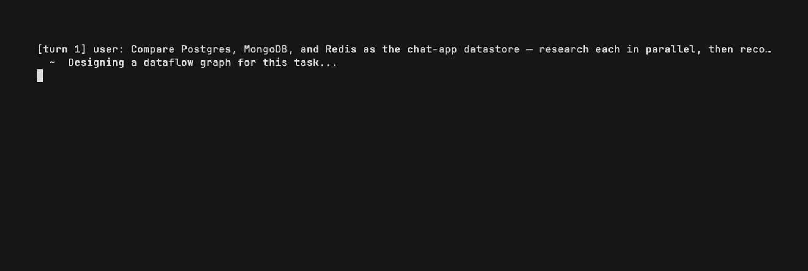
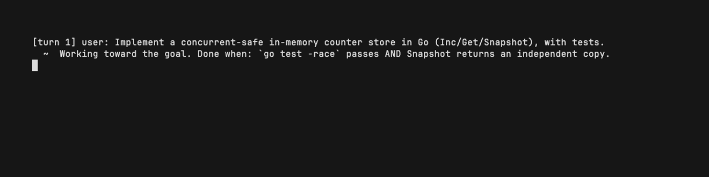
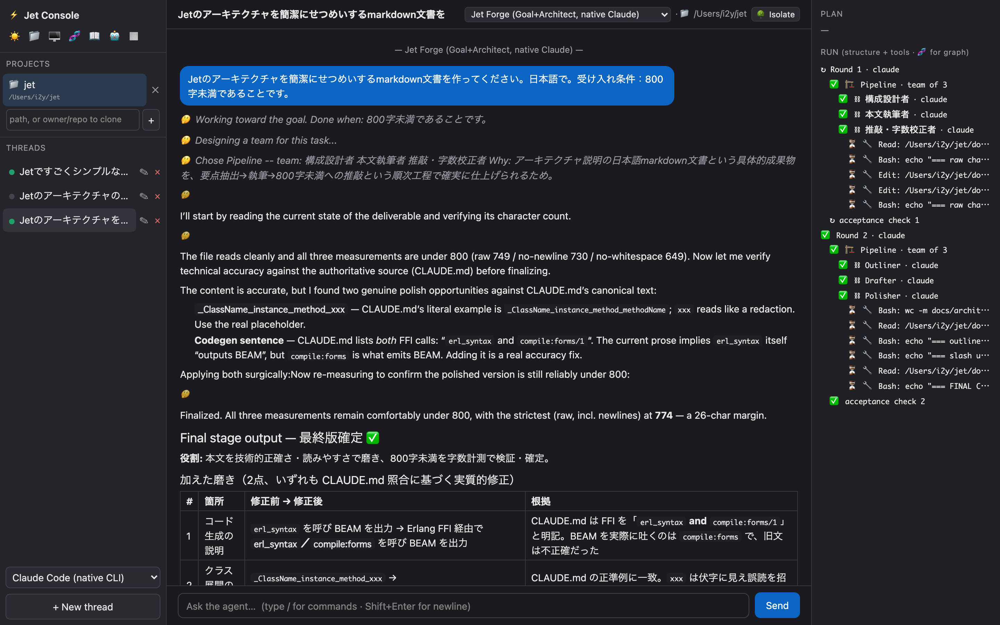

[English](README.md) | **日本語**


# エージェントは1つのファイル

```jet
# sage.jet
module sage
  agent Sage
    model "ollama:qwen3.6:35b-a3b"      # 本物のローカルモデル（API キー不要）
    role "You research rigorously and cite sources."
    expose answer(question) -> {answer: String, sources: [String]?}
  end
end
```

```sh
jet acp-serve sage::Sage::answer sage.jet
```

このファイルは、もうあなたのエディタの中のエージェントです。
任意の [ACP](https://agentclientprotocol.com) クライアントがそのエージェントを駆動でき、応答はトークン単位でストリームし、セッションは記憶し、plan と tool 呼び出しはネイティブに描画されます。
コマンドを `jet mcp-serve` に変えれば、同じファイルが [MCP](#mcp双方向) サーバになります（tools・resources・prompts のいずれもエージェント自身です）。
`catalog/0` を足して同じファイルを `console/agents/` に置けば、[Web UI](#web-ui-で動かすjet-console) にも現れ、保存すると再コンパイルされてホットロードされます。

**あなたのシステムを Jet で書き直す必要はありません。**
採用の単位は1ファイルです。
設定ファイルと同じ単位で、その後ろにコンパイラとスーパーバイザがいる、というだけの違いです。

そのファイルが手に入れるもののうち、チャット API のラッパーでは手に入らないものを挙げます。

- **監督される**：クラッシュさせれば OTP が再起動します。1万体動かせます。
- **マシンをまたいで生き残る**：フリートを複数の BEAM ノードに分散し、ノードを丸ごと落としても、スーパーバイザが生存ノードにエージェントを再配置します。
- **他のコーディングエージェントを駆動できる**：`drives "claude-code-acp"`（またはアダプタ不要の `drives "claude"`）で、Claude Code や Codex が監督下の Jet フリートのメンバーになります。
- **宣言したスキーマが黙って壊れない**：`-> {answer: String, sources: [String]?}` はヒントではなく[契約](#schema-aligned-parsing)です。


## 2,000体のクラッシュとノード障害

そして同じモデルがスケールします。
監督された1万体のエージェントのうち2,000体をランダムにクラッシュさせても、フリートは無傷です。
死んだものだけが再起動し、残りは何も気づきません。


さらにフリートはマシンをまたぎます。
同じ監督付きフリートを2つの BEAM ノードに分割し、実行中にワーカーノードごと落としても、スーパーバイザが生存ノードにエージェントを再配置します。
k8s もキューもサイドカーも要りません。
Erlang の分散と monitor を、Jet から動かしているだけです。


LLM の `Fleet` runner も同じことをします。
`nodes: ["b@host"], retry: 2` でメンバーをノードに配置し、失われたものを生存ノードで再生成します（[docs/features.ja.md](docs/features.ja.md) を参照）。

実行可能な例は [`examples/pitch.jet`](examples/pitch.jet)（1つ目の GIF）、[`examples/fleet.jet`](examples/fleet.jet)（フリート）、[`examples/fleet_dist.jet`](examples/fleet_dist.jet)（2ノード、自己修復）です。

同じフリートが、[エディタの中](#エディタの中のエージェントacp-経由)でも [Jet Console](#web-ui-で動かすjet-console) でもそのまま動きます。

## `object = actor = agent`

あのファイルが小さいのは、エージェントが言語の中の形式であって、言語の上に載ったライブラリではないからです。
一つのオブジェクトモデルと一つの呼び出し構文 `x.method()` が、ローカルな値から並行プロセス、監督された AI エージェントまでを貫きます。

```ruby
class Point                                    # ただの値
  def dist()  math::sqrt(@x * @x + @y * @y)  end
end

agent Sage                                     # AI エージェント（同じ x.method() 呼び出し）
  model "ollama:qwen3.6:35b-a3b"                # 本物のローカル LLM（API キー不要）
  expose answer(q) -> {answer: String}          # ネイティブな、スキーマ型付き出力
end

actor Worker                                   # エージェントは監督されたプロセスにすぎない
  def add(n)  @total = @total + n  @total  end
  def on_message(_)  erlang::error(:boom)  end   # クラッシュさせる。スーパーバイザが再起動する
end
```

AI エージェントは長命で、状態を持ち、並行で、壊れやすいものです。
これはまさに BEAM が1986年から扱ってきた性質です。
そこで当然の疑問が出ます。

## なぜライブラリではなく言語なのか

ここは正直に書きます。
都合のいい説明は、Elixir を知っている人には通用しないからです。

**Elixir でもほとんど実現できます。**
protocol は第1引数でディスパッチするので、struct と PID を同じ呼び出しで扱えます。
マクロは `agent` 形式も、その裏の gen_server も、状態のスレッディングも、Future も生成できます。
マクロはコンパイル時に走るので、警告すら出せます。
以下の機能のほぼ全てはライブラリで表現可能で、欠けている `x.method()` は記法であって能力ではありません。

ライブラリにできないのは、**書き手を止めること**です。

ライブラリでは、あらゆる安全装置は「呼べば効く関数」であり、下位のプリミティブは常に1キーストローク先にあります。
言語なら、それが唯一の経路になりえます。
これが規約と保証の違いです。

| | ライブラリの場合 | Jet の場合 |
|---|---|---|
| 宣言された `-> Type` | validator を呼び忘れなければ検証される | 全 runner と全シェイプが[単一のパーサ](#schema-aligned-parsing)を通り、`agent` 面に迂回路がない |
| スキーマを満たせない応答 | 呼び出し側が書いたもの。多くは生テキストで、原因から遠い場所で失敗する | `{:error, {:schema_mismatch, …}}` をフィールド名付きで、原因の場所で返す |
| runner 名のタイプミス | dispatch の fallback（あれば） | 既知の runner を列挙したエラー。捏造データは返さない |
| 型名やオプションキーのタイプミス | 実行時の驚き、あるいは無反応 | コンパイル時、またはターン実行前に却下 |
| enum 値が漏れた `match` | 本番で発見 | 値を名指しするコンパイラ警告 |

どれも賢いことはしていません。
ただ選択の余地がないだけです。
そしてその「選択の余地のなさ」こそ、ライブラリには提供できず、言語にしか提供できないものです。

記法はこの判断を正当化するのではなく、そこから帰結します。
エージェントが第一級の形式になってしまえば、値とプロセスとエージェントを貫く `x.method()` は、そのオブジェクトモデルの当たり前の見え方にすぎません。
[`expose`](#エージェント) は `actor` と `agent` で文字どおり同じキーワードであり、違いは戻り値の型だけです。

では Gleam ではなぜないのでしょうか。
Jet 自身のコンパイラは Gleam で書かれているのに、です。
Gleam は設計としてマクロを持たないので、`agent` 形式は原理的にライブラリになりえません。
そして静的型は、LLM が何を返すかを約束できませんし、[`Architect` と `Flow`](#協調シェイプ) が実行時に生成するトポロジを記述できません。
Jet は意図して動的型付けであり、その代償を、宣言済みで閉じた部分に対する[狙いを定めた検査](#コンパイラが検査するもの)で払っています。

## エージェント

`agent` キーワードは、オブジェクトに LLM とエージェントのランタイムを与えます。
`agent` は [`actor`](#アクター) とプラガブルな **runner** に脱糖され、呼び出しは非同期です（`Future` を返し、`.await()` や `.stream do |ev|` で受けます）。
エージェントは actor と全く同じ `expose` でインタフェースを宣言し、戻り値の型がターンの返り方を決めます。

```ruby
# 思考する機械: 型付きの答えを expose する
agent Researcher
  model "claude-opus-4-8"                   # プロセス内 LLM runner
  role "You research rigorously and cite sources."

  expose research(question) -> {answer: String, sources: [String]}
  tool web_search                           # 呼び出せる peer やエージェント、MCP
end

r = Researcher.spawn()
r.research("What is the BEAM?").await()     # => {:ok, {answer: ..., sources: [...]}}
```

```ruby
# 外部のコーディングエージェント: 仕事を expose し、TurnResult を得る
agent Coder
  drives "claude-code-acp"                  # 外部エージェントを ACP 経由で駆動
  role "Test-driven. Minimal diffs."
  workspace "./src"                         # fs サンドボックスのルート

  expose fix(description) -> TurnResult     # .text / .ok? / .edits / .plan / ...

  def on_approval(req)                      # このエージェントの権限ポリシー
    match req.get(:kind)
      case "execute"
        :deny
      case _
        :allow
    end
  end
end

Coder.spawn().fix("make the failing test pass").stream do |ev|   # 作業を眺める
  match ev
    case {:plan, steps}
      io::format("plan: ~p~n", [steps])
    case {:tool_call, t}
      io::format("-> ~ts~n", [t.get(:title)])
    case {:text, s}
      io::format("~ts", [s])
    case _
      :ok
  end
end
```

- **`expose m(args)`**：`actor` と共有する唯一の宣言形式。戻り値の型が配送方法を決めるので、第二のキーワードを覚える必要はありません。
  - `->` なし：自由テキスト。
  - **`-> Type`**：型付きの答え。スキーマはヒントではなく契約です（[後述](#schema-aligned-parsing)）。
  - **`-> TurnResult`**：エージェントがした仕事（`.text` / `.ok?` / `.edits` / `.commands` / `.plan` / `.files` / `.tool_calls`）であって、スキーマに強制された値ではありません。
  - `ask m(...)` と `task m(...)` は旧表記で、引き続き使えます。
- **`runner X(...)`**：唯一のバックエンド形式。`model X` と `drives "cmd"` はその短縮形で、それぞれ `runner Llm(model: X)` と `runner Acp(command: "cmd")` を意味します。プロセス内の LLM ターン、または外部の [ACP](https://agentclientprotocol.com) エージェント（`claude-code-acp` 経由の Claude Code、`npx @zed-industries/codex-acp` 経由の Codex など）を動かし、`drives "claude"` なら Claude Code CLI をアダプタなしで直接駆動します。セッションは永続し（メモリ）、出力はストリームし、fs と terminal はサンドボックス化されます。あらゆる協調シェイプと `Fake` も同じ形式です。
- **`tool …`**：エージェントが呼べる他のエージェント、関数、MCP サーバ。任意の `, :kind`（`:execute` / `:read` / `:edit` / `:fetch` など）でそのツールが**何をするか**を宣言でき、`on_approval` はこれを見てゲートします。未宣言は推測せず `"other"` になります。
- **`def on_approval(req)`**：エージェントの権限リクエストをゲートします（`:allow` / `:deny`）。`on_terminate` や `on_message` と同じ `on_*` コールバック規約です。外部 ACP エージェントのリクエストと native のツール呼び出しは、どちらも `jet_policy::request` が同じ形に整えるので、`req.get(:kind)` の読み方は共通で、ポリシーは1つで両方を覆います。
- **`.stream do |ev|`**：構造化されたターンイベント（`{:text, _}` `{:thought, _}` `{:tool_call, _}` `{:plan, _}` `{:usage, _}` `{:prompt, _}`）。`{:prompt, …}` は実際に送信されたリクエスト（`system` / `input` / `model`）を、全 runner と全シェイプメンバーについて運びます。プロンプトの改善が、推測ではなく実物を読む作業になります。

詳しくは [`docs/agent_design.md`](docs/agent_design.md) と [ACP プロトコルのシーケンス](docs/acp_sequence.md)（いずれも英語）を参照してください。
API キーなしで今すぐエージェントを動かしたい場合は、[エディタの中のエージェント](#エディタの中のエージェントacp-経由)がローカル LLM（Ollama）で動かします。

### Schema-Aligned Parsing

「JSON だけで答えよ」と言われたモデルは、それでも markdown フェンスで包み、先に考えを述べ、`'` でクォートし、カンマを落とし、数値を文字列で返します。
Jet はやり直しを求めません。
リトライは往復のコストを払ったうえで、大抵は同じ出力が返ってくるだけだからです。
代わりに、宣言されたスキーマに照らして応答を修復します。

```jet
expose research(question) -> {answer: String, sources: [String], confidence: Int}
```

| モデルが実際に送ってきたもの | 得られるもの |
|---|---|
| フェンスで囲まれた塊、その前後の散文、先頭の `<think>…</think>` | 値 |
| `{answer: 'hi', sources: 'one', confidence: '85',}` | `{answer: "hi", sources: ["one"], confidence: 85}` |
| `source_list:` と宣言したのに `{"sourceList": [...]}` | 一致する |
| `{"answer": "hi"}` で `sources` が無い | `value.sources` を名指しした `{:error, {:schema_mismatch, …}}` と部分値 |

これを「善処」ではなく契約にしているのは、二つの性質です。
あらゆる修復は宣言された型に許可されて行われます。
単独の文字列が1要素のリストになるのは、スキーマが `[String]` と言っているからであって、都合が良さそうだからではありません。
そしてあらゆる修復には値段がついています。
ひとつの応答のあらゆる読み方のうち最も安いものが勝ち、データを持っていることが小さな修正の山より優先されるので、フィールドが1つ欠けたオブジェクトが「何も一致しなかった散文」に負けることはありません。

それでも満たせないスキーマは、原因の場所で失敗します。
3フレーム先でクラッシュする binary を呼び出し側に渡したりはしません。

これは全 runner と全シェイプに効きます（[`src/jet_sap.jet`](src/jet_sap.jet)）。
[BAML](https://boundaryml.com/blog/schema-aligned-parsing) のリファレンス実装の設計から移植したものです。
そのテストスイートは「モデルが実際にやること」の一覧です（`./jet -r jet_sap::run_tests src/jet_sap.jet`）。

スキーマの型は `String`、`Int`、`Float`、`Bool`、`Atom`、`[T]`、`{k: T}`、`enum(:a, :b, :c)` で、フィールドには2つの修飾子を付けられます。

```jet
expose research(q) -> {answer:    String   "one sentence, no preamble",
                       sources:  [String]? "URLs only, no titles",
                       certainty: Int?}
```

**enum** は閉じた集合であり、モデルの答えを突き合わせる価値が最も高い場所です。
`stale`、`"current"`、`UNRELATED`、`I'd say stale.` はすべて正しい値に着地し、`stale or current` は推測されず、曖昧として報告されます。

`?` は飾りではなく、値段を変えます。
必須フィールドの欠落は上のスコアで 100、任意フィールドの欠落は 1 です。
この差こそがこの記号の意味であり、「モデルが正当に省略した」と「答えが間違っている」が、これで別の出来事になります。
`null` は欠落として扱われます。

説明文は宣言と一緒に運ばれ、書くのは一度きりです。
モデルはコンパクトなプロンプトスキーマの中で `"string // URLs only, no titles"` を見ますし、生成を制約するバックエンドには JSON Schema 自身の `description` として渡ります。
実行可能な例は [`examples/agent_optional_schema.jet`](examples/agent_optional_schema.jet) です。

### コンパイラが検査するもの

ここでは動的型付けが正しい選択です。
LLM が何を返すかを約束できる型システムはありませんし、BEAM のメールボックスは型付けされておらず、`Architect` と `Flow` は実行時にトポロジを生成するので静的型では表現できません。
しかし一部のものは宣言済みで、閉じていて、既に AST の中にあります。
なので検査します。
間違えたときの代償は、もっともらしいナンセンスではなく、間違えた場所でのエラーになります。

| 書いたもの | 以前 | 現在 |
|---|---|---|
| `-> {answer: Strng}` | タイプミスが atom になり、あらゆる値に適合した | 有効な型名を列挙したパースエラー |
| `runner Fleeet(...)` | stub runner に落ち、それがスキーマ準拠の値を合成していた。タイプミスが成功に見える捏造データを返していた | 既知の runner を列挙した `{:error, {:unknown_runner, …}}` |
| `runner Fleet(member: …)` | 黙って空のフリート | `{:error, {:unknown_runner_options, …}}`。各シェイプ自身のマニフェストで検査するので、シェイプはライブラリ層のまま |
| enum 値が漏れた `match` | いずれ実行時の `badmatch` | 忘れた値を名指しするコンパイル時の警告 |

網羅性の検査は、同一の関数本体にある `a = Agent.spawn()` と `match a.method(…)` を結びつけます。
関数境界を越えると止まります。
動的言語では、パラメータが何を保持しているかを教えてくれるものが何もないからです。
そしてこれはエラーではなく、常に警告です。

ただし宣言はプロジェクトのどこにあっても構いません。
`jet build src/` は、どれかをコンパイルする前に全ファイルをパースするので、あるモジュールの `expose … -> enum(...)` が、別のモジュールに書かれた `match` に対して検査されます。
これがマクロには届かないケースです。
Elixir はモジュール単位でコンパイルし、マクロは自分の展開結果しか見ないので、宣言と `match` が同時に視界に入ることがありません。

実行可能な例は [`examples/agent_enum_check.jet`](examples/agent_enum_check.jet)（1モジュール）と [`examples/enum_xmodule/`](examples/enum_xmodule)（2モジュール）です。

Ollama バックエンドでは、スキーマがモデルに届く経路が2つあります。
`runner Llm(structured: :constrained)` は既定で、JSON Schema をサンプリング文法にコンパイルするので形が保証されます。
`structured: :prompt` はコンパクトなスキーマをプロンプトに入れ、`jet_sap` が修復します。
どちらが勝つかはモデルごとなので、他人のベンチマークを継承するより、手元のモデルで測る価値があります。
[`examples/sap_structured_ab.jet`](examples/sap_structured_ab.jet) が同じタスクで両方を走らせ、スキーマ適合率、回答の正しさ、レイテンシを報告します。

### エージェントのテスト

````jet
agent Researcher
  runner Fake(replies: "Sure!\n```json\n{\"answer\": \"42\"}\n```")
  expose research(question) -> {answer: String}
end
````

`Fake` は決め打ちのテキストで答えますが、そのテキストは本物の応答と同じパースを通ります。
なのでテストが固定するのは、モックに言い含めた答えではなく、モデルが雑なときに呼び出し側が実際に受け取るものです。
`replies:` は値、`{method: reply}` のマップ、`fn(method, args)` のいずれも取ります。
モデルも API キーもネットワークも要りません。

[`examples/agent_fake_test.jet`](examples/agent_fake_test.jet) は3つのエージェントを動かします。
markdown で包まれたもの、1ターンに5つの欠陥があるもの、そしてフィールドが欠けて正しく失敗するものです。

## 協調シェイプ

上のノード kill から回復した `Fleet` は、シェイプの一つです。
**シェイプは言語機能ではなく標準ライブラリです。**
2つのプリミティブ runner（`Acp` と `Llm`）、テスト用の `Fake`、そして9つの協調シェイプがあり、どれも共有基盤の上の「runner モジュール1つとディスパッチ1行」にすぎません（`jet_backend` がメンバーを `{:ollama, model}` か `{:acp, command}` に解決し、実行し、テキストを返します）。
同じ `agent` と `expose` の裏で、runner がターンの動かし方を選びます。
なのでどのシェイプも同じものを無料で継承します。
メンバーは監視された BEAM プロセスとして動き（crash 分離されるので、1つ落としても残りは配送します）、出力はストリームし、それぞれが ACP でサーブ可能で、かつ直接も使えます（`spawn().m().await()`）。
メンバーはローカルモデル（`model:`）でも任意の外部 ACP エージェント（`drives:` で Claude Code、Codex、Gemini など）でもよく、バックエンドは常に利用者の選択で、決して仮定されません。

| runner | トポロジ | 何をするか |
|---|---|---|
| `Acp` | 外部エージェント1つ | `claude-code-acp` / `codex` / `gemini` を ACP 経由で駆動 |
| `Llm` | プロセス内 LLM 1つ | Jet がループを回す（Ollama のネイティブ構造化出力、またはホステッドプロバイダ） |
| `Fleet` | スター、並列 | N 人のメンバーが1つの話題を並列に分析し、lead が統合する（mixture-of-agents） |
| `Pipeline` | チェーン | 逐次的なステージ。各段が前段を変換する（`implement → test → review`） |
| `Refine` | ループ | worker が草案を書き、critic が講評し、承認まで反復（evaluator-optimizer） |
| `Debate` | メッシュ | メンバーが対立する立場でラウンドを重ね、judge が結論を出す |
| `Auto` | ルータ | ルータが実行時にメニューから最適なシェイプを選ぶ |
| `Architect` | 自己生成 | designer がこのタスクのためのチーム（シェイプと役割）を書き、そして実行する |
| `Flow` | 生成された DAG | designer がエージェントのデータフローグラフを生成し、独立ノードが並列に走る |
| `Goal` | 検証ループ | 機械的に検査可能な `accept:` 条件が検証されるまで試行を続ける |
| `Plan` | 計画から実行へ | planner が目標をステップに分解して順に実行し、ステップが何も生まなければ再計画する。`via:` で各ステップをサブシェイプに通せる |

```ruby
# Pipeline — 逐次ステージ。各段が前段の上に積む
runner Pipeline(drives: "claude-code-acp", stages: [
  {name: "Implement", role: "Write the code."},
  {name: "Test",      role: "Build and test it; show the output."},
  {name: "Review",    role: "Review quality and security."}])

# Debate — 対立する立場と judge
runner Debate(model: "ollama:qwen3.6:35b-a3b", rounds: 2,
  agents: [{name: "For",     role: "Argue in favor."},
           {name: "Against", role: "Argue against."}],
  judge: {role: "Weigh both sides and decide."})

# Architect — タスクのためのチーム（シェイプと役割）を設計し、そして実行する
runner Architect(drives: "claude-code-acp")

# Flow — データフローグラフを生成する。独立ノードは BEAM 上で並列に走る
runner Flow(drives: "claude-code-acp")

# Goal — 受け入れ条件が検証可能に満たされるまで続ける（"/goal" の発想）
runner Goal(drives: "claude-code-acp",
            accept: "go build ./... and go test ./... pass, shown with the real output")
```

メタオーケストレータ（`Auto` と `Architect`）とグラフ生成器（`Flow`）はトポロジを実行時に決めます。
MetaGen や Maestro の方向性ですが、ここでは LLM 駆動で、しかも BEAM 上なので監督されています。
ハルシネーションで生まれたノードがクラッシュしても、致命傷ではなく分離されます。
`Goal` は "/goal" 機能が広めたループを閉じます。
安価なチェッカーが、機械的に検査可能な条件で各ラウンドをゲートします（この条件はプロンプトから来ることもあります）。
`Codegen` は `workspace: :worktree` を付けた `Fleet` です。
N 人のエージェントが同じタスクをそれぞれの git worktree で実装し、lead が最良の diff を選びます。

コストを意識したモデル選択も組み込みです。
単一の `model:` の代わりに、反復するシェイプ（`Goal` と `Refine`）に階層順の `models:` プールと `select:` モードを与えます。
`:escalate` はまず安いモデルで試し、チェックが結果を却下したときだけ強いモデルに上げます。
`:route` は安価なルータが各モデルのプロフィールを読み、タスクごとに最適なものを選びます。
プールは自分で選んだ Ollama モデルや ACP エージェントで構成されるので、大きなモデルはそれに値するときだけ動きます（[escalate](examples/acp_goal_escalate_demo.jet)、[route](examples/acp_goal_route_demo.jet)）。





実行可能な例は [Pipeline](examples/acp_pipeline_demo.jet)、[Refine](examples/acp_refine_demo.jet)、[Debate](examples/acp_debate_demo.jet)、[Auto](examples/acp_auto_demo.jet)、[Architect](examples/acp_architect_demo.jet)、[Flow](examples/acp_flow_demo.jet)、[Goal](examples/acp_goal_demo.jet)、[Plan](examples/agent_planner_demo.jet)、[Codegen](examples/acp_codegen_demo.jet) です。

自分のシェイプを足すには、`turn/4` を持つモジュール1つと `dispatch/4` の case 1つを書きます。
`runner Name(...)` の DSL は名前を総称的に解決するので、パーサの変更は要りません（[Adding your own shape](docs/agent_design.md#67-adding-your-own-shape)、英語）。

### MCP、双方向

Jet は MCP を ACP と同じ水準で、双方向に話します。

サーバとしては、`jet mcp-serve Module::Agent::method file.jet` がエージェント全体を stdio JSON-RPC の背後に置きます。MCP の3つのプリミティブはいずれもエージェントそのものです。

| MCP | 対応するもの |
| --- | --- |
| `tools` | `expose` したメソッド（1つにつき1ツール）と `tool` 宣言 |
| `resources` | `jet://agent/role`、`jet://agent/manifest`、`jet://memory/conversation`、`jet://memory/facts` |
| `prompts` | `skills` |

`tools/call` は専用プロセスで走るため、実行中も `ping` と2本目の呼び出しは生きたままです。`_meta.progressToken` を伴う呼び出しではターンが `notifications/progress` として流れ、`notifications/cancelled` はエージェントを殺さずにターンだけを終わらせます。宣言された `-> Type` はテキストに加えて `structuredContent` としても返ります。公開されたエージェントからクライアントを呼び返すこともできます（`jet_mcp::roots`、クライアントのモデルを借りる `jet_mcp::sample`、`jet_mcp::elicit`）。[`examples/mcp_server_demo.jet`](examples/mcp_server_demo.jet) を参照。

クライアントとしては、`mcp "…"` で宣言した外部 MCP サーバを消費し、そのツールがターン中に呼べるようになります（[`examples/agent_mcp_demo.jet`](examples/agent_mcp_demo.jet)）。接続は ACP と同じく双方向です。サーバからの `ping` / `roots/list` / `sampling/createMessage` には応答し（サンプリングはエージェント自身のバックエンドで走ります）、progress とログの通知は他のイベントと同じバスに乗ります。ツールだけでなく `resources/*` と `prompts/*` も使えます。`Acp` ランナーのエージェントで宣言されたサーバは、外部エージェントにもそのまま渡されます。

両側は互いに対してテストされており、モデルも API キーもネットワークも要りません（[`examples/test_mcp_client.jet`](examples/test_mcp_client.jet)）。

### OpenTelemetry

エンドポイントを設定すれば、すべてのターンがトレースになります。コードの変更も、エージェントごとの設定も要りません。

```sh
OTEL_EXPORTER_OTLP_ENDPOINT=http://localhost:4318 ./jet -r App::run app.jet
```

```
jet.agent.turn                       ← ターンごとに1つのルートスパン。ターン全体のトークン数を持つ
└─ 🏗 Fleet · team of 2               ← シェイプの各ノードが、実際の親の下に入れ子になる
   ├─ 👤 Researcher
   │  └─ gen_ai.usage qwen3.6         ← gen_ai.usage.input_tokens / .output_tokens
   └─ 👤 Critic                       ← status code 2。このメンバーは失敗した
```

このツリーは、Console の実行ビューを描くためにランタイムがすでに組み立てていたものです。[`jet_otel`](src/jet_otel.jet) はそれを OTLP/HTTP JSON として送り出す唯一の場所であり、シェイプもランナーも例も、観測可能になるために変更を必要としませんでした。バックエンド呼び出しとツール呼び出しは `gen_ai.*` のセマンティック規約に従い、プロバイダへの HTTP には W3C の `traceparent` が乗り、送信はバッチ処理のバックグラウンドプロセスで走るため、テレメトリがターンを遅くすることはありません。設定は標準のもの（`OTEL_EXPORTER_OTLP_ENDPOINT`、`OTEL_EXPORTER_OTLP_TRACES_ENDPOINT`、`OTEL_EXPORTER_OTLP_HEADERS`、`OTEL_SERVICE_NAME`、`OTEL_SDK_DISABLED`）で、**エンドポイントが設定されるまでは無効で、コストもゼロ**です。実行可能な例は [`examples/test_otel.jet`](examples/test_otel.jet)。

## エディタの中のエージェント（ACP 経由）

同じ `agent` が本物のエディタの中で動きます。
`jet acp-serve Module::Agent::method file.jet` が [Agent Client Protocol](https://agentclientprotocol.com) 上に公開するので、任意の ACP クライアントが駆動できます。
応答はトークン単位でストリームし、セッションは記憶し、plan と tool 呼び出しはネイティブに描画されます。

**1. Hello, agent**：本物のローカル LLM、ストリーミング、会話メモリつき。

```ruby
agent Sage
  model "ollama:qwen3.6:35b-a3b"           # 本物のローカル LLM（API キー不要）
  role "You are a helpful assistant. Be concise."
  expose reply(message)                    # 自由テキストの回答、ストリーミング
end
```

**2. 本物のエージェント**：ディスクに触れずにファイルについて答えます。
ターンの途中で、同じ ACP 接続を通してエディタ側に読み取りを依頼します。

```ruby
agent Reader
  model "ollama:qwen3.6:35b-a3b"
  role "Call read_file with the path you're given, then answer strictly from its contents."
  expose describe(request)
  tool read_file(path: String) do |p|
    match jet_acp_server::read_file(p)      # エージェントからクライアントへの要求、ターン中
      case {:ok, res}
        maps::get(<<"content">>, res, <<"(empty)">>)
      case _
        "could not read it"
    end
  end
end
```

**3. 監督されたフリート**：1つの ACP エージェントの背後で、N 体のサブエージェントが並列に動きます。
それぞれが独自の視点を持つ独立した BEAM プロセスです。
監視され crash 分離されているので、1体を kill しても残りは配送します。
その後 lead エージェントが各自のメモを1つの結論に統合します。
監督されたフリートをまたぐ map と reduce です。

```ruby
agent Panel
  runner Fleet(model: "ollama:qwen3.6:35b-a3b", members: [   # フリートの LLM（メンバー個別に上書き可）
    {name: "Risks",   role: "Name the biggest risks."},
    {name: "Upside",  role: "Name the biggest benefits."},
    {name: "Skeptic", role: "Say why it might fail."}])
  expose review(topic)
end
```

実行可能な例では、クラッシュするよう仕組んだ4人目のメンバーを足しています。
下の GIF では、そのメンバーが分離され（`failed`）、残り3人はきちんと配送しています。


ターミナルから駆動するか、ACP クライアントを向けてください。

```sh
# stdio 上の ndjson JSON-RPC。ACP クライアントはこれを話すし、スクリプトからでも同じ
jet acp-serve acp_fleet_demo::Panel::review examples/acp_fleet_demo.jet
```

```jsonc
// 例: エディタの ACP agent-server 設定（ここでは Zed の ~/.config/zed/settings.json）。
// 設定後、Agent Panel で "Jet Panel" を選びます。GUI から起動したエディタの PATH に
// Homebrew が無いことがあるので PATH を固定しています（jet は escript です）。
"agent_servers": {
  "Jet Panel": {
    "type": "custom",
    "command": "/abs/path/to/jet",
    "args": ["acp-serve", "acp_fleet_demo::Panel::review", "/abs/path/to/examples/acp_fleet_demo.jet"],
    "env": { "PATH": "/opt/homebrew/bin:/usr/bin:/bin" }
  }
}
```

実行可能な例は [`examples/acp_demo.jet`](examples/acp_demo.jet)、[`examples/acp_fs_demo.jet`](examples/acp_fs_demo.jet)、[`examples/acp_fleet_demo.jet`](examples/acp_fleet_demo.jet) です。

## Web UI で動かす（Jet Console）

同じエージェントが **[Jet Console](console/)** の中で動きます。
Phoenix LiveView の Web アプリで、純粋な BEAM です（Node も Electron も使いません）。
プロジェクト、並列スレッド、markdown の会話、埋め込みターミナル、リアルタイムの plan と tool アクティビティのパネルを備えます。
スレッドごとにバックエンドを選び（ローカルモデル、任意の ACP エージェント、または直接駆動する Claude Code CLI）、ノーコードのフォームでエージェントを組み立て、スレッドを独自の git worktree に隔離できます。



**インストールは要りません。**
各 OS 向けの自己完結バイナリがリポジトリにコミットされています。
ERTS、アプリ、Jet の stdlib を [Burrito](https://github.com/burrito-elixir/burrito) が同梱したものです。
Elixir も Erlang も Node も要らず、環境変数も要りません（初回起動時に自分で secret を生成して永続化します）。

```sh
./console/burrito_out/jc_macos start     # jc_linux · jc_windows.exe → http://localhost:4000
```

Elixir がある場合は、ソースからでも動かせます。

```sh
cd console && mix setup && mix phx.server   # → http://localhost:4000
```

スクリーンショットは[並列スレッドのボード、ノーコードのエージェントビルダー、ファイルビューア、ターミナル](console/README.md#screenshots)（英語）にあります。
バイナリを自分でビルドする手順は [`console/README.md`](console/README.md#single-binary-per-os-burrito)（英語）を参照してください。

## 言語機能

### 型

```ruby
# 数値
49        # 整数
4.9       # 浮動小数点数

# 真偽値
true
false

# atom
:foo

# リスト
list = [2, 3, 4]
[1, *list]             # => [1, 2, 3, 4]
[head, *rest] = list   # head => 2, rest => [3, 4]

# タプル
{1, 2, 3}

# マップ
dict = {name: "jet", version: 2}
dict.get(:name, "?")  # => "jet"

# 文字列（charlist）
"Hello"

# バイナリ
<<1, 2, 3>>
<<"abc">>

# 無名関数
add = {|x, y| x + y}
add.(3, 4)  # => 7

multiply = do |x, y|
  x * y
end
```

### 変数の再束縛

```ruby
# x = x + 1 がそのまま書ける。コンパイラが新しい BEAM 変数を生成する
total = 0
total = total + 10
total = total + 20
total  # => 30
```

### クラスと不変な状態

`@attr` がインスタンス状態の読み書きです。
変更のたびに新しいオブジェクトが返り、元のオブジェクトは変わりません。
`initialize` の末尾では、コンパイラが自動的に `self` を返します。

```ruby
# Point.jet — 単体のクラス（module で包む必要はない）
class Point
  def initialize(x, y)
    @x = x
    @y = y
  end

  def move(dx, dy)
    @x = @x + dx
    @y = @y + dy
    self
  end

  def x()  @x  end
  def y()  @y  end
end

p = Point.new(0, 0)
p2 = p.move(3, 4)
# p は変わらない。変更のたびに新しいオブジェクトが返る
```

### ミックスイン

継承ではなく合成で組み立てます。

```ruby
class Stack
  include Enumerable

  def initialize()
    @items = []
  end

  def push(item)
    @items = [item, *@items]
    self
  end

  def reduce(acc, func)
    lists::foldl({|item, a| func.(a, item)}, acc, @items)
  end
end

s = Stack.new().push(10).push(20).push(30)
s.map {|n| n * 2}                 # => [60, 40, 20]
s.reduce(0) {|acc, n| acc + n}    # => 60
```

### アクター

`actor` キーワードはプロセスに支えられたクラス（OTP gen_server）を作ります。
`expose` がその公開インタフェースを宣言します。
これは [`agent`](#エージェント) が使うのと同じキーワードであり、`object = actor = agent` をランタイムだけでなく構文レベルでも真にしているのはこの点です。
違いは、agent では戻り値の型がターンの返り方も決めることだけです。
actor のインスタンス状態は gen_server の状態そのもので、クラスと同じ `@attr` 構文で更新され、スレッディングは自動なのでメソッドは `self` を返す必要がありません。
生きている状態は `sys:get_state` で覗けます。

```ruby
actor ChatRoom
  expose post(user, text), recent(n), count()

  def initialize(name)
    @name = name
    @messages = []
  end

  def post(user, text)
    @messages = [{user, text}, *@messages]
    :ok
  end

  def recent(n)
    lists::sublist(@messages, n)
  end

  def count()
    erlang::length(@messages)
  end

  def on_terminate(reason)
    puts("Room closing: ~p", [reason])
  end
end

room = ChatRoom.spawn("general")
room.post("alice", "Hello!")
room.count()  # => 1

# 非同期と cast
future = room.async().count()
future.await()        # => 1
room.cast().post("bob", "Fire and forget")

# タイマーと生メッセージ
room ! {:custom, "message"}     # 生メッセージを送る（on_message が処理する）
send_after(1000, room, :ping)   # 遅延メッセージ

# monitor
monitor(room)  # 終了時に {:DOWN, ref, :process, pid, reason} を受け取る
```

### 効果の宣言（`needs` と `platform`）

```ruby
module Greeter
  needs Console

  def self.greet(name)
    Console::puts("Hello, " ++ name ++ "!")
  end
end

# 具体的な実装は platform ブロックで与える
platform Production
  provide Console with StandardConsole
end
```

### パターンマッチ

```ruby
match {x, y}
  case {0, 0}
    "origin"
  case {0, _}
    "on Y axis"
  case {x, y} if x == y
    "on diagonal"
  case _
    "somewhere else"
end
```

### エラー処理

`try` と `catch`、`finally` が回復可能な失敗を扱います。
捕捉される値は `:class`、`:reason`、`:stacktrace` を持つ例外マップです。
通常の「起こりうる失敗」には `{:ok, _}` と `{:error, _}` のタグ付きタプルと `match` を優先し、`try` は例外を投げるコードのラップやリトライ、後始末のために取っておいてください。

```ruby
def safe_div(a, b)
  try
    {:ok, a / b}
  catch e
    {:error, e.get(:reason)}    # b == 0  =>  {:error, :badarith}
  finally
    puts("attempted")           # 任意。成功時も失敗時も走る
  end
end

raise :boom                     # 値を raise する（erlang:error/1 にコンパイルされる）
```

`finally` は任意で、後始末だけなら `try` から `catch` を省略できます（`try ... finally ... end`）。

### Erlang 相互運用

```ruby
# 任意の Erlang/OTP モジュールを :: 構文で呼ぶ
node = erlang::node()
timer::sleep(1000)
lists::sort([3, 1, 2])  # => [1, 2, 3]
```

`import` はありません。
BEAM のモジュール名はグローバルで実行時に解決されるので、修飾された呼び出しはそれ自体で完結しています。
Erlang が import を必要としないのと同じ理由です。
`alias` は名前を隠さずに短くします。

```ruby
alias jet_backend as B

B::to_bin(topic)        # jet_backend::to_bin(topic) と読まれる
```

パース時の純粋なリネームです。
呼び出し側は修飾されたままなので、`B::` は依然としてリモート呼び出しだと見て分かり、ファイル冒頭の1行がその正体を示します。
`import` のもう半分、つまり修飾なしで名前を取り込み、読み手がローカル呼び出しとリモート呼び出しを区別できなくする方は、Erlang 自身の `-import` が非推奨とされている理由そのものなので、Jet は提供しません。

### 高階関数

```ruby
nums = [5, 3, 8, 1, 9]

nums.map {|n| n * 2}             # => [10, 6, 16, 2, 18]
nums.select {|n| n > 4}          # => [5, 8, 9]
nums.reduce(0) {|acc, n| acc + n}  # => 26

3.times do |i|
  puts("tick ~p", [i])
end
```

## 必要環境

- Erlang/OTP >= 26.0
- Gleam >= 1.0

## インストール

```sh
$ git clone https://github.com/i2y/jet.git
$ cd jet
$ gleam build
$ gleam export erlang-shipment && escript build_escript.erl
$ ./jet --help
```

## 使い方

### 単一ファイルのコンパイル

```sh
$ ./jet Foo.jet
```

### コンパイルして実行

```sh
$ ./jet -r Foo::bar Foo.jet
```

### エージェントを ACP でサーブする

`agent` を任意の [ACP](https://agentclientprotocol.com) クライアントに stdio 経由で公開します。
ファイル側にサーブ用のボイラープレートは要りません。

```sh
$ ./jet acp-serve Module::Agent::method Foo.jet
```

デモと設定例は[エディタの中のエージェント](#エディタの中のエージェントacp-経由)を参照してください。

### エージェントを MCP でサーブする

同じエージェントを、同じくボイラープレート無しで、任意の [MCP](https://modelcontextprotocol.io) クライアントに公開します。
expose したメソッドと `tool` が tools に、role・構成・メモリが resources に、`skills` が prompts になります。

```sh
$ ./jet mcp-serve Module::Agent::method Foo.jet
```

詳細は [MCP、双方向](#mcp双方向)を参照してください。

### プロジェクトのビルド

```sh
$ ./jet build src/
```

### escript（単体実行ファイル）のビルド

すべての `.beam` を1つの実行ファイルにまとめます。
対象マシンに Erlang が必要です。

```sh
$ ./jet escript MyApp src/
$ ./myapp
```

### OTP リリースのビルド

`bin/` のランチャと `ebin/` の beam を持つリリースディレクトリを生成します。

```sh
$ ./jet release MyApp src/
$ ./_release/bin/myapp
```

エントリポイントの規約として、`jet escript` と `jet release` は `Module::main()` を呼びます。
アプリのモジュールに `def self.main()` を定義してください。

### テストの実行

```sh
$ gleam test                                               # コンパイラ: lexer, parser, codegen
$ ./jet -r jet_sap::run_tests src/jet_sap.jet              # Schema-Aligned Parsing
$ ./jet -r jet_architect::run_tests src/jet_architect.jet  # Architect シェイプのガード
```

自分のエージェントをテストするには `Fake` runner を与えてください。
決め打ちの応答が本物のスキーマパースを通るので、モデルも API キーもネットワークも要りません（[エージェントのテスト](#エージェントのテスト)を参照）。

### コーディングエージェントに Jet を書かせる

Jet は新しいので、どのモデルの学習データにもほぼ含まれていません。
しかも Ruby に似ているため、エージェントは Ruby 風の、コンパイルできないコードを自信を持って書きます。
`.jet` を書くプロジェクトに [`jet-lang`](.agents/skills/jet-lang) Agent Skill をコピーしてください。

```sh
$ mkdir -p .agents/skills && cp -R /path/to/jet/.agents/skills/jet-lang .agents/skills/
```

Jet のチェックアウト内ではインストールは不要です。
また `jet_skills` が同じ `.agents/skills` を走査するので、**Jet エージェント自身**がこのスキルを読んで Jet を書くこともできます。
記載されている事実はすべて probe で裏付けられています（`.agents/skills/jet-lang/probes/run.sh`）。
何が Jet で通るかの権威は文書ではなくコンパイラだからです。

## 影響を受けたもの

Jet は [Erlang](http://www.erlang.org) 仮想マシン（BEAM）上で動く、動的型付けの OOP-関数型言語です。
構文とオブジェクトモデルは [Ruby](https://www.ruby-lang.org) と [Reia](https://github.com/tarcieri/reia) の影響を受けています。
