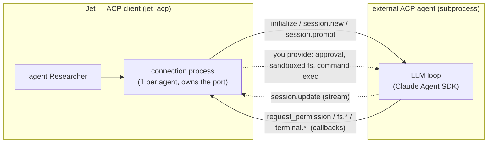
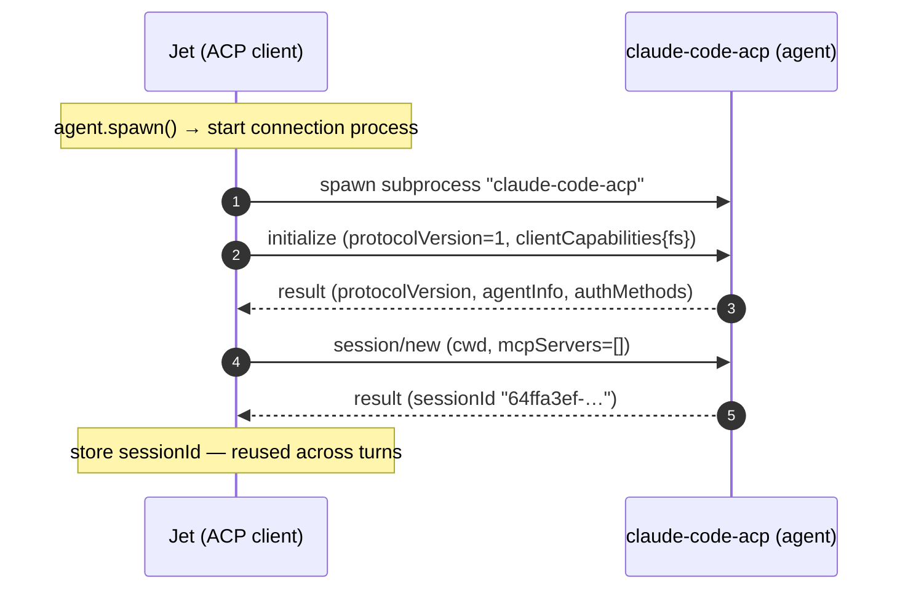
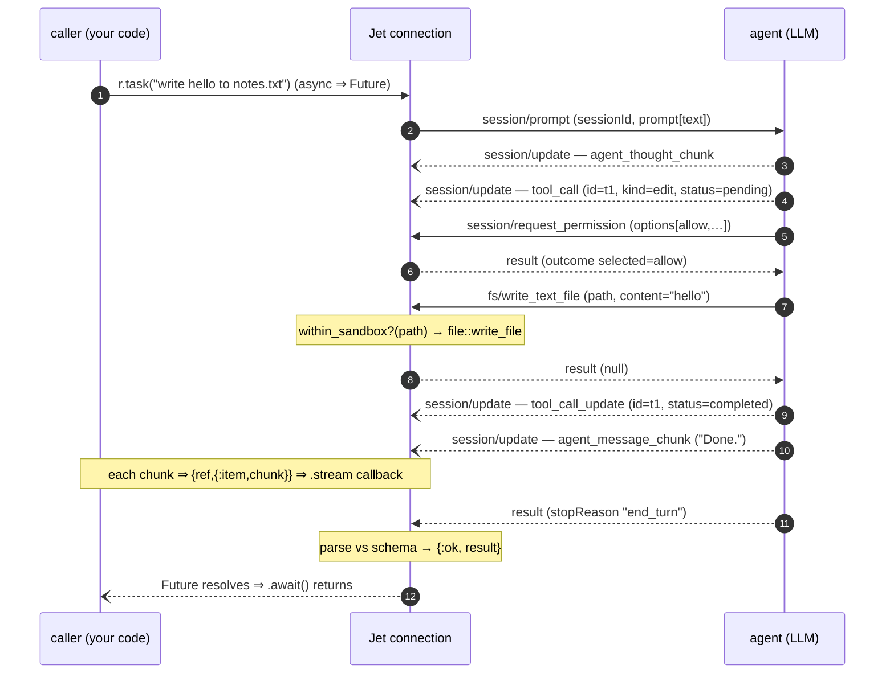
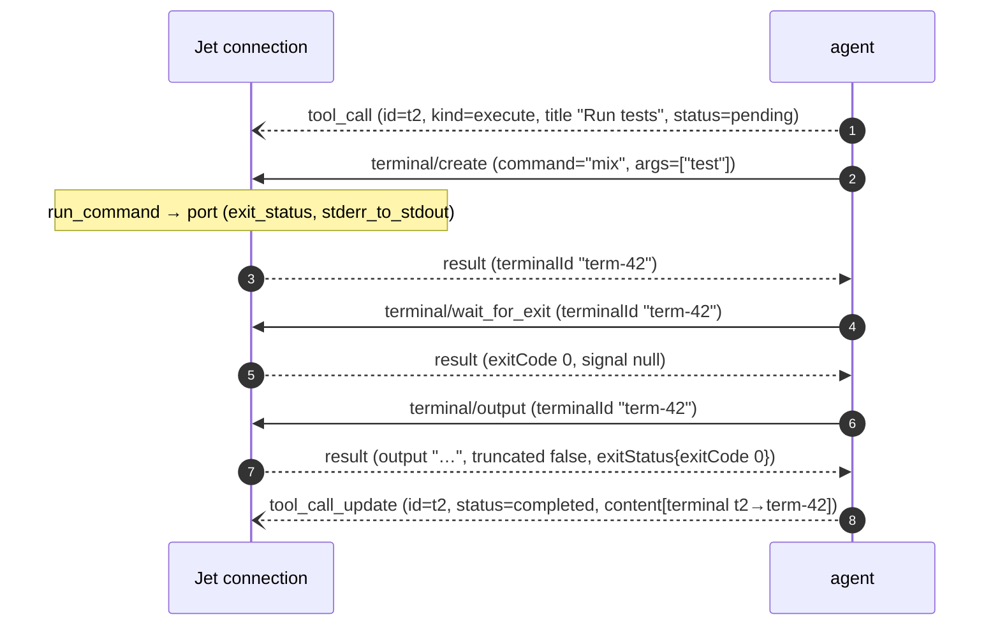
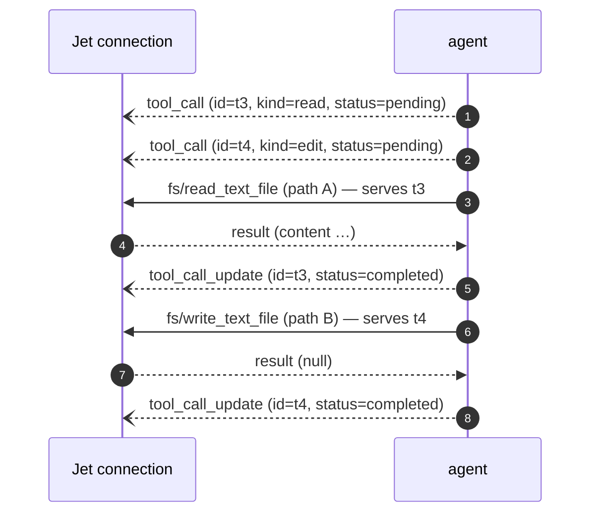
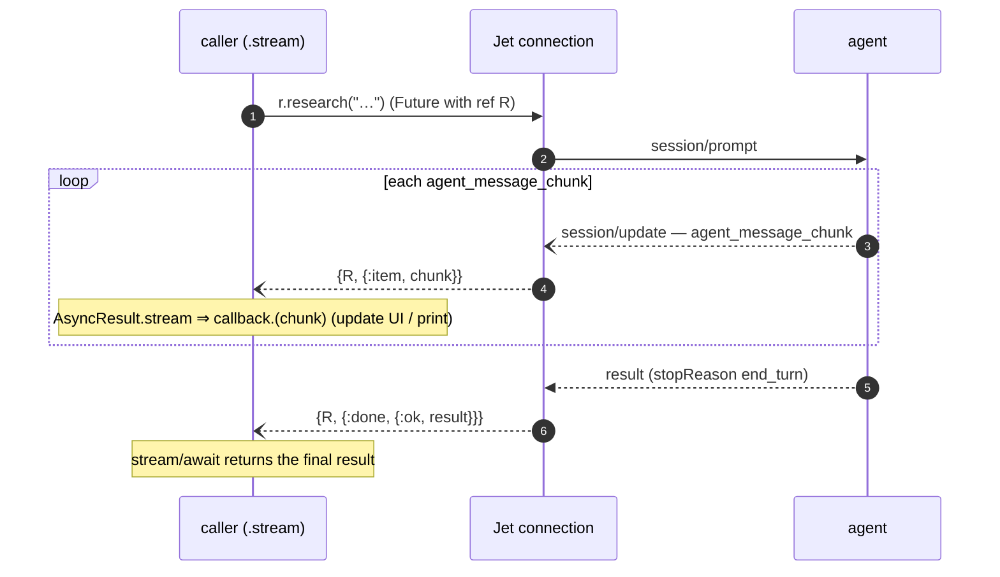
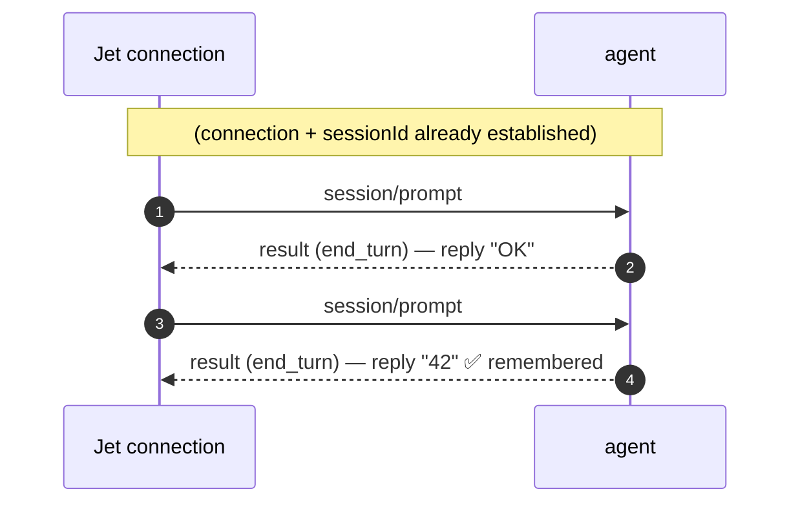

# ACP Runner — Protocol Sequences

How Jet's `Acp` runner (`runner Acp(command: "claude-code-acp")`) talks to a real
external AI agent over the **Agent Client Protocol** (ndjson JSON-RPC 2.0 over
stdio). Each section shows the user-side Jet code that drives one call, then the
sequence it expands into on the wire. Observed against the real
`@zed-industries/claude-code-acp` (Claude Code over ACP).

> The runner is **agent-agnostic**: the same `jet_acp` drives any ACP agent —
> just swap the command. e.g. `npx @zed-industries/codex-acp` for OpenAI Codex
> (see [`examples/agent_codex.jet`](../examples/agent_codex.jet)), or a Gemini
> CLI adapter. Codex's own *App Server* is a separate protocol that the
> `codex-acp` adapter bridges to ACP.

- **Jet side = ACP _client_** — the per-agent connection process (`jet_acp`). This is your `agent`.
- **External side = ACP _agent_** — the spawned subprocess; inside it runs the actual LLM (Claude Agent SDK).
- **Transport** — one JSON-RPC message per `\n`-delimited line, on the subprocess's stdin/stdout. stderr is kept separate (`separate_stderr`) so stdout carries only protocol.

The defining property is that it is **bidirectional**: mid-turn, the agent calls
*back* into Jet for permissions, filesystem, and terminal. The LLM is the "head";
Jet is its "hands and feet" (the sandboxed execution environment).



## Usage (the trigger for every sequence)

A Jet user writes only this: declare an `agent`, `spawn()` it, call a method.
`agent` desugars to an `actor` (gen_server) + a runner, and method calls are
**async** (they return a `Future`) — `.await()` for the result, or
`.stream do |chunk| … end` for incremental output.

```ruby
agent Researcher
  runner Acp(command: "claude-code-acp")     # drive an external agent over ACP
  role "You research rigorously and cite sources."
  expose research(question) -> {answer: String, sources: [String]}  # structured result
  expose task(instruction)                                          # no schema -> text
end

r = Researcher.spawn()                         # §1: the connection comes up
r.research("What is the BEAM?").await()        # §2: one turn => {:ok, {answer, sources}}
r.research("…").stream do |chunk|              # §5: streaming
  io::format("~ts", [chunk])
end
```

Each section below shows how one of these calls expands on the wire. Runnable
example: [`examples/agent_acp.jet`](../examples/agent_acp.jet) (uses a local mock ACP).

## 1. Connection setup (once per agent)

```ruby
r = Researcher.spawn()
```

`spawn()` starts the connection process and runs `initialize → session/new` once.
The resulting `sessionId` is held in `r`'s state and reused for every turn
(= conversation memory).



## 2. A turn — the bidirectional dance

```ruby
r.task("write hello to notes.txt").await()
# task has no schema -> the result is text: {:ok, "Done."}
```

You only `await()`. But inside this one turn the agent calls *back* into Jet for
permission (`request_permission`) and `fs/write_text_file`; Jet serves those and
the turn proceeds (the middle of the diagram).



Legend: solid `->>` = request (expects a response), dashed `-->>` = response,
open `--)` = notification (no response). Requests **from the agent** (permission,
`fs/*`, `terminal/*`) are the callbacks Jet must answer.

`stopReason` ∈ `end_turn | refusal | max_tokens | max_turn_requests | cancelled`.
`refusal` is surfaced as `{:error, :refusal}`. With a schema-typed method the
result is validated and coerced to a typed Jet value, e.g.
`{:ok, {answer: …, sources: […]}}`.

Permission requests route to the agent's optional `on_approval(req)` (default
`:allow`) — return `:deny` to refuse, or a specific `optionId`:

```ruby
def on_approval(req)
  match req.get(:kind)        # "execute" | "edit" | "read" | …
    case "execute"
      :deny                   # e.g. never let it run shell commands
    case _
      :allow
  end
end
```

## 3. Deep dive — `tool_call` lifecycle

```ruby
r.task("run the tests with mix test, then summarize failures").await()
# an execute tool -> terminal/create -> wait_for_exit -> output callbacks (below)
```

From the caller it's the same single call; whether to use a tool is the agent's
decision. When it does, it streams a `session/update` with
`sessionUpdate: "tool_call"`, then one or more `tool_call_update`s. The shape
(ACP schema v1):

| field | meaning |
|---|---|
| `toolCallId` | stable id correlating the call and its updates |
| `title` | human label ("Write notes.txt") |
| `kind` | `read · edit · delete · move · search · execute · think · fetch · switch_mode · other` |
| `status` | `pending → in_progress → completed \| failed` |
| `content` | output blocks — `content` (text), `diff` (file diff), or `terminal` (links a `terminalId`) |
| `locations` | `{path, line}` the tool touches — lets a UI "follow along" in the editor |
| `rawInput` / `rawOutput` | provider-raw tool args/result |

A tool call usually *also* triggers a callback Jet must serve (the actual side
effect). e.g. an `execute` tool:



Commands run with the session root as cwd, and `fs/*` is confined to the sandbox.
(v1 runs the command **synchronously** inside `terminal/create`; streaming /
long-running terminals are a follow-up.)

## 4. Deep dive — multiple / parallel tools

```ruby
r.task("read config.exs and write a sanitized copy to config.sample.exs").await()
# multiple tools (fs/read + fs/write) in one turn; still a single call.
```

The agent may interleave several tool calls in one turn, each with a distinct
`toolCallId`. They share **one** connection, so Jet serves the callbacks **in
arrival order**, one at a time — a selective `receive` on the port keeps each
tool's bytes separate. Updates are correlated by `toolCallId`, so a UI can render
several tool cards updating independently even though the client serves them
sequentially.



Caveat: because `terminal/create` runs synchronously in v1, a long command blocks
the read loop until it exits (other interleaved messages queue, then drain).
Async/streaming terminals would remove that — a noted follow-up.

## 5. Deep dive — streaming to `.stream do |chunk| … end`

```ruby
r.research("Summarize BEAM scheduler design in 3 points").stream do |chunk|
  io::format("~ts", [chunk])      # called per chunk (to a TUI / WebSocket / LiveView)
end
# the block is called per chunk; the final result ({:ok, {answer, sources}}) is returned
```

`.await()` waits for just the result; `.stream do …` passes each intermediate chunk
to the `do` block and still returns the final result. That one line is the only
difference in user code.



The `do` block runs in the caller process, so it can print tokens, push to a
WebSocket/LiveView, or update a TUI as they arrive — backpressure is natural (the
connection only advances as the caller consumes).

## 6. Multi-turn (session reuse = memory)

```ruby
r.task("Remember the number 42.").await()    # turn 1
r.task("What number did I say?").await()      # turn 2 => {:ok, "42"} (remembered)
```

Calling on the same `r` (same connection, same `sessionId`) continues the
conversation. The second turn skips setup and reuses the stored `sessionId`; the
agent retains prior context.



Verified live: turn 2 answered **"42"**. One connection process per agent owns
one ACP session for the agent's lifetime; it `monitor`s the agent and exits when
the agent dies.

## 7. Reference — implementation map (`src/jet_acp.jet`)

You write only the code above; internally `jet_acp` handles the protocol:

| sequence step | `jet_acp` (and friends) |
|---|---|
| spawn + initialize + session/new | `open_connection → connection_init → init_session` |
| receive a turn, send prompt | `connection_loop` (`{:turn}`) → `run_prompt` → `send_req("session/prompt")` |
| pump the ndjson stream | `await` (split on `\n`) → `handle_line` → `dispatch` |
| accumulate / stream chunks | `accumulate → append_content → emit_item` (→ caller) |
| answer agent callbacks | `handle_server_request` → `handle_fs_* / handle_terminal_* / permission` |
| sandbox check | `within_sandbox?` (reject `..`, require under session root) |
| structure the result | `parse_result` (decode → `jet_agent::coerce` → `jet_agent::validate`) |
| caller side | `jet_agent.AsyncResult` (`await` / `stream`) |

## 8. Status & limits

Implemented and verified against real `claude-code-acp`: initialize/session, the
prompt turn, streaming, session reuse (memory), `fs/read|write_text_file`,
`terminal/*`, permission via an `on_approval` hook (default allow), and
schema-parse of structured output.

Follow-ups: symlink-tight fs sandbox, async/streaming
terminals, and surfacing `tool_call`/`plan` updates to the caller (not just text
chunks).
