[English](features.md) | **日本語**

# Jet — 機能ガイド

Jet は、Ruby ライクな構文を持つ動的型付けの OOP・関数型言語で、BEAM（Erlang VM）バイトコードにコンパイルされます。その中心的なアイデア:

> **`object = actor = agent`** — 単一のオブジェクトモデルと単一の呼び出し構文（`x.method()`）が、ローカルな値 → 監視下の並行プロセス → AI エージェント までを一貫して扱う。

これは機能の実践的なツアーです。より詳しい資料: 言語と agent の概要は [README](../README.md)、agent の内部は [agent_design.md](agent_design.md)、ACP のワイヤプロトコルは [acp_sequence.md](acp_sequence.md)、web UI は [console/README.md](../console/README.md) を参照してください。

---

## 目次

1. [クイックスタート](#クイックスタート)
2. [Jet Console — Phoenix LiveView 製 UI](#1-jet-console--phoenix-liveview-製-ui)
3. [Agent システム](#2-agent-システム)
4. [コラボレーション shape（マルチエージェントのパターン）](#3-コラボレーション-shape--マルチエージェントのパターン)
5. [ネイティブ agent 機能（memory・skills・tools・planning）](#4-ネイティブ-agent-機能)
6. [動的モデル選択](#5-動的モデル選択)
7. [その他の機能](#6-その他の機能)
8. [アーキテクチャ](#アーキテクチャ)
9. [FAQ](#faq)

---

## クイックスタート

### 前提条件

- **Erlang/OTP ≥ 26** と **Gleam ≥ 1.0** — コンパイラをビルドするため。
- **Elixir ~> 1.15** — Jet Console 用（Erlang/OTP も同梱される。プリビルドのバイナリを使うなら不要）。
- 任意: **Ollama**（ローカルモデル、API キー不要）や `claude` CLI / `claude-code-acp`（外部エージェント）。

### コンパイラのビルド

```sh
git clone https://github.com/i2y/jet.git && cd jet
gleam build
gleam export erlang-shipment && escript build_escript.erl
./jet --help
```

### CLI

```sh
./jet Foo.jet                                  # Foo.beam にコンパイル
./jet -r Module::func Foo.jet                  # コンパイルしてモジュール関数を実行
./jet acp-serve Module::Agent::method Foo.jet  # agent を ACP 経由で公開（stdio）
./jet build src/                               # ディレクトリをコンパイル
./jet escript MyApp src/                       # 単独実行ファイルにまとめる（実行環境に Erlang が必要）
./jet release MyApp src/                       # OTP リリース
```

### web UI を起動する（Jet Console）

```sh
cd console && mix setup                                   # 依存関係 + esbuild/tailwind（Node 不要）
( cd .. && for f in src/*.jet; do ./jet "$f"; done )      # Jet 標準ライブラリの beam を一度コンパイル
mix phx.server                                            # → http://localhost:4000
```

または、**プリビルドの単一バイナリ** — マシンに Elixir/Erlang 不要、環境変数も不要:

```sh
./console/burrito_out/jc_macos start   # (jc_linux / jc_windows.exe) → http://localhost:4000
```

### 最初の agent

```jet
# hello.jet
module hello
  agent Greeter
    model "ollama:qwen3.6:35b-a3b"     # ローカルモデル — API キー不要
    role "You are a friendly assistant. Be concise."
    ask greet(name) -> {greeting: String}
  end
end
```

**Jet Console** で選ぶか、任意の [ACP](https://agentclientprotocol.com) クライアントに公開できます:

```sh
./jet acp-serve hello::Greeter::greet hello.jet
```

---

## 1. Jet Console — Phoenix LiveView 製 UI

Jet agent 向けのブラウザ UI — **純粋な BEAM、Node なし、Electron なし**。プロジェクト、並列スレッド、markdown の会話、リアルタイムの plan + tool アクティビティパネル、埋め込みターミナル、ファイルビューア/エディタを備えます。


### システムアーキテクチャ

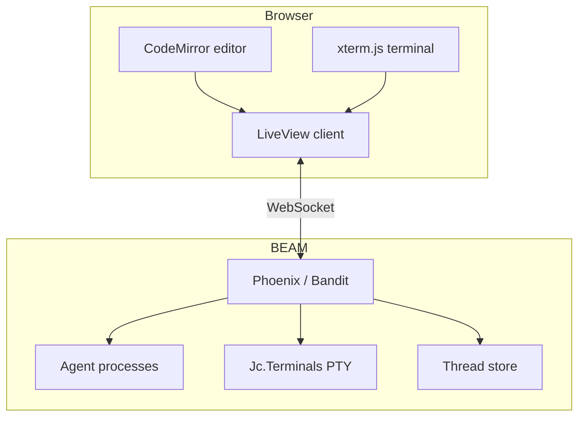

### 主な機能

| 機能 | 説明 |
|------|------|
| **プロジェクト** | フォルダをプロジェクトとして開く（または `owner/repo` を入力して `gh` でクローン）。存在しないディレクトリを開くと作成される。 |
| **並列スレッド** | 各スレッドが自分の agent を駆動する（ローカルモデル、ACP agent、**または**ネイティブ Claude CLI）。自由に切り替え/作成できる。スレッドと会話はリロードやサーバ再起動をまたいで**永続化**され、実行中のターンもリロードを生き延びる。 |
| **スレッドごとのバックエンド** | カタログからバックエンドを選ぶ。各スレッドは独立。 |
| **ノーコード agent ビルダー** | 🤖 Agents パネルで agent を作成 / 編集 / 削除。**Save** で `.jet` ファイルを再コンパイルして hot-load — 再起動不要。 |
| **並列スレッドボード** | スレッドカードのグリッド。各カードにリアルタイムの plan/tool 構造を表示。 |
| **Git worktree 分離** | スレッドを専用の git worktree（🌳）に分離し、衝突なく並列作業できる。 |
| **対話的な承認** | tool の権限リクエストが 🔐 Allow/Deny プロンプトとして現れる。 |
| **通知・ダーク/ライトテーマ・停止/キャンセル** | 完了通知（バックグラウンドタブからでも）、テーマ切り替え、実行中ターンの停止。 |

### 組み込み agent（カタログ）

| Agent | 役割 | バックエンド |
|--------------|------|-------------|
| Local Assistant | 汎用アシスタント | Ollama |
| Jet Coder | ファイルを編集 | Ollama |
| Jet Researcher | web リサーチ | Ollama + `jet_web` |
| Claude Code (ACP) | ACP アダプタ経由で Claude Code を駆動 | ACP |
| Claude Code (native CLI) | `claude` CLI を**直接**駆動（アダプタなし） | native |
| Jet Forge (Goal+Architect) | 証明できるまで検証。タスクごとにチームを設計 | Claude (ACP **または** native) |
| Jet Verified Coder (Goal+Flow) | 受け入れチェックで検証しながらコーディング | Claude (ACP **または** native) |
| Routed | 安価 / 高性能なローカルモデルをタスクに応じてルーティング | Ollama プール |

### 独自 agent を作る

agent はいくつかの宣言の集まりです（各要素は [§2](#2-agent-システム) で解説）。Console は小さなカタログ規約でそれを拾い上げます。ファイルを手書きしても、ブラウザのビルダーを使っても、**Save で再コンパイルして hot-load — サーバ再起動は不要**です。

#### 実践的な例 — ファイルを編集するコーディング agent

ローカルで動く Node 不要の agent の例。role、呼び出せる型付き tool、ターンごとの tool 予算、危険なシェルコマンドをブロックする承認ポリシーを備えます（[`examples/agent_coder_demo.jet`](../examples/agent_coder_demo.jet) を元にしています）:

```jet
# agents/my_agents.jet
module my_agents
  agent Coder
    model "ollama:qwen3.6:35b-a3b"        # ローカルモデル（Claude CLI なら `drives "claude"`）
    tool_fuel 25                           # ターンあたりの最大 tool 呼び出し回数 — コーディングは多くの往復を要する
    role "You are a coding assistant working under /tmp/sandbox. Use read_file / write_file / edit_file / list_dir there, and `run` for shell commands. Verify by re-reading. Be concise."

    tool read_file(path: String) do |p|              # 型付きパラメータが tool の JSON schema になる
      jet_fs::read(p)
    end
    tool write_file(path: String, content: String) do |p, c|
      jet_fs::write(p, c)
    end
    tool edit_file(path: String, old: String, new: String) do |p, o, n|
      jet_fs::edit(p, o, n)
    end
    tool list_dir(path: String) do |p|
      jet_fs::list(p)
    end
    tool run(command: String) do |c|                 # シェルへの脱出口 — 下でゲートする
      os::cmd(erlang::binary_to_list(erlang::iolist_to_binary(["cd /tmp/sandbox && ", c])))
    end

    # 各 tool 呼び出しをゲート: 危険なシェルコマンド（rm/sudo/curl/…）を拒否。ファイル tool は通す
    approve do |req|
      jet_policy::gate(req, <<"run">>, {|r| jet_policy::deny_tokens(r, jet_policy::default_deny())})
    end

    ask code(task)                         # （型付きの）回答。TurnResult が欲しければ `task m(args)`
  end
  # … 下に catalog/0 + spawn_for/1 …
end
```

**各要素の役割**

| 宣言 | 役割 |
|---|---|
| `model "ollama:…"` / `drives "claude"` | バックエンド — ローカルモデル、または外部/ネイティブの Claude agent |
| `role "…"` | システムプロンプト |
| `ask m(args) -> Schema` | **schema 検証された**値を返す呼び出し |
| `task m(args)` | **`TurnResult`** を返す呼び出し（`.text` / `.edits` / `.commands` / …） |
| `tool name(p: Type) do \|p\| … end` | 呼び出せる tool。型付きパラメータがモデルの埋める JSON schema になる。`tool name` 単体 = ローカル実装のない peer。 |
| `tool_fuel N` | ターンあたりの tool 呼び出し上限（agentic ループの予算） |
| `approve do \|req\| … end` | 各 tool / 権限リクエストをゲート（`:allow`/`:deny`）。`jet_policy` に既製の allow/deny リストポリシーがある |
| `mcp "npx …"` | 外部 MCP サーバの tool を取り込む |
| `memory "id"` · `skills "dir"` | 永続的な会話メモリ · progressive disclosure な skills |
| `runner Shape(…)` | 単一の `model`/`drives` の代わりにマルチエージェントの [shape](#3-コラボレーション-shape--マルチエージェントのパターン) を使う |

#### Console のピッカーに表示する

`agents/` 以下の各ファイルは `catalog/0`（ピッカーの項目）と `spawn_for/1`（キー → spawn した agent）を export します。Console はそれらすべてを集約します:

```jet
  def self.catalog()
    [{:coder, "My Coder (local)"}]
  end

  def self.spawn_for(key)
    match key
      case :coder
        my_agents::Coder.spawn()           # agent はモジュール修飾で参照する
      case _
        nil
    end
  end
```

#### ノーコードビルダーと hot reload

🤖 **Agents** パネルでは、同じ agent をフォームから作成でき（名前・role・バックエンド・tools・shape — コード不要）、**バックエンド設定**を調整したり、生の **`.jet`** を編集したりできます。いずれの場合も **Save すると `jet` escript でファイルを再コンパイルし、新しい beam をピッカーに hot-load — サーバ再起動は不要**です（`Jc.AgentStore` がコンパイル/ロード/CRUD を担当。ビルダー製の agent は `custom_agents.jet` に入り、`agents/builtin.jet` が組み込みを seed します）。新しい `agents/*.jet` を置いて Save すれば、すぐにピッカーに現れます。


### ブラウザ側のコンポーネント

**ファイルビューア / エディタ** — プロジェクト（またはスレッドの git worktree）をツリーで閲覧し、CodeMirror 5 でシンタックスハイライト付きに編集でき、**レンダリング済みプレビュー**が得られます: Markdown と **HTML**（サンドボックス化した iframe 内）、インライン画像、2 MB 超のファイルには「大きすぎる」ガード、そして 👁 プレビュー / ✎ ソースの切り替え。下は `README.md` をレンダリング表示したところ:


**埋め込みターミナル** — xterm.js と、監視下の `Jc.Terminals` GenServer が所有する PTY により、ターミナル（と実行中の長いコマンド）は**ブラウザのリロードを生き延びます**。**スレッドごと**で、そのスレッドの cwd（プロジェクトまたは worktree）で開き、会話の下にドッキングし、ペイン幅にリアルタイムで追従します:


**並列スレッドボード** — スレッドカードのグリッド。各カードに agent・状態・リアルタイムの plan/tool 構造が表示され、複数の agent が同時に動く様子を見られます:


**リッチなチャット** — highlight.js によるコードブロック、**Mermaid** 図、トークン単位でストリーミングされる応答、agent がファイルを編集したときの色付き diff。

### パッケージング

| 形式 | サイズ | 備考 |
|------|--------|------|
| **OTP リリース** | 約 35 MB | 自己完結、ERTS 同梱 |
| **単一バイナリ (Burrito)** | 約 17〜32 MB/OS | OS ごとに1つの自己展開ファイル（macOS/Linux/Windows）。`console/build_binary.sh <target>` |

このバイナリは**環境変数なし**（`./jc_macos start`）で動きます — 初回起動時に secret を生成して永続化し、既定で `localhost:4000` を提供します。LAN に公開するには `JET_CONSOLE_BIND_ALL=1`、別ポートには `PORT=…` を設定します。

---

## 2. Agent システム

`agent` キーワードは、LLM/agent ランタイムを備えたオブジェクトを裏付けます。`agent` は `actor`（監視下の OTP プロセス）と差し替え可能な **runner** に desugar され、呼び出しは**非同期**です（`Future` を返す — `.await()` / `.stream do |ev|`）。

```jet
agent Researcher
  model "ollama:qwen3.6:35b-a3b"
  role "You research rigorously and cite sources."
  ask research(question) -> {answer: String, sources: [String]}
  tool web_search
end
```

### `ask` と `task`

| 種別 | 返り値 | 用途 |
|------|--------|------------|
| `ask m(args) -> Type` | 型付きで schema 検証された値 | 分析、Q&A、構造化抽出 |
| `task m(args)` | `TurnResult`（`.text` / `.ok?` / `.edits` / `.commands` / `.plan` / `.files`） | コード変更、ファイル/コマンド作業 |

### バックエンド

| 宣言 | Runner | 説明 |
|------|---------|------|
| `model "ollama:…"` | `Llm` | BEAM 上でインプロセス実行するローカルモデル |
| `drives "claude-code-acp"` | `Acp` | [ACP](https://agentclientprotocol.com) 経由で外部 agent を駆動（Claude Code, Codex, Gemini, …） |
| `drives "claude"` | native | Claude Code CLI を**直接**駆動、アダプタなし |

### ツール

```jet
agent FileHelper
  model "ollama:qwen3.6:35b-a3b"
  tool read_file(path: String) do |p|      # 型付きパラメータ + 実装ブロック
    jet_fs::read(p)
  end
  tool web_search                           # 単体 — ローカル実装のない peer/tool の宣言
  ask help(request) -> String
end
```

### 承認ポリシー

```jet
agent SafeAgent
  model "ollama:qwen3.6:35b-a3b"
  approve do |req|
    match req.get(:kind)
      case "execute"
        :deny                               # コマンドは決して実行しない
      case _
        :allow
    end
  end
  task work(request)
end
```

### MCP クライアント

agent は外部の MCP サーバを**利用**できます — その tool がターンの途中で呼び出せるようになります:

```jet
agent Echoer
  model "ollama:qwen3.6:35b-a3b"
  mcp "npx -y @modelcontextprotocol/server-everything"
  tool_fuel 25                              # ターンあたりの tool 呼び出し総数の上限（ループガード）
  ask say(text) -> {reply: String}
end
```

Jet は MCP を**サーバ**としても話します（`jet_mcp::handle` が `tools/list` / `tools/call` に応答）。

---

## 3. コラボレーション shape — マルチエージェントのパターン

どの shape も、共有基盤（`jet_backend`）上の **runner モジュール + 1 行の dispatch** です。すべてが無償で以下を継承します: メンバーは**監視下の BEAM プロセス**として動き（クラッシュ分離 — 1 つを kill しても残りは配送を続ける）、出力は**ストリーミング**され、それぞれが **ACP で公開可能**で、バックエンドは**ユーザーの選択**（ローカルモデルでも任意の ACP agent でも）。

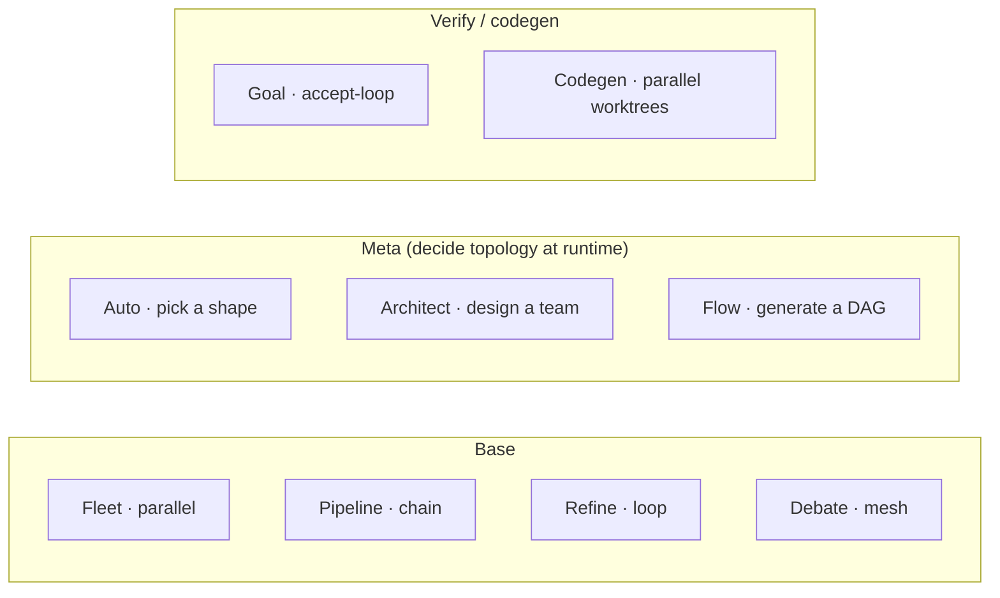

| runner | トポロジー | 何をするか |
|---|---|---|
| `Fleet` | star · 並列 | N 個のメンバーが並列に分析し、lead が統合（mixture-of-agents） |
| `Pipeline` | chain | 逐次的なステージ（`implement → test → review`） |
| `Refine` | loop | worker が下書きし、critic がレビュー、承認まで繰り返す |
| `Debate` | mesh | メンバーが複数ラウンドで対立する立場を論じ、judge が結論を出す |
| `Auto` | router | router が実行時に最適な shape を選ぶ |
| `Architect` | self-generating | タスクに合わせてチーム（shape + 役割）を設計し、実行する |
| `Flow` | generated DAG | データフローグラフを生成。独立したノードは並列に動く |
| `Goal` | verify-loop | 機械的に検査できる `accept:` 条件を満たすまで試行 |
| `Codegen` | parallel worktrees | N 個の agent が各自の git worktree で同じタスクを実装し、lead が最良を選ぶ |

### 各 shape

> 以下の各ブロックは shape の `runner` 行だけを示しています。実際に動かすには `agent … / ask · task … / end`（[§2](#2-agent-システム)）に入れてください。

**Fleet** — N 個のメンバーが同じタスクを並列に分析し、lead が統合する（mixture-of-agents）。

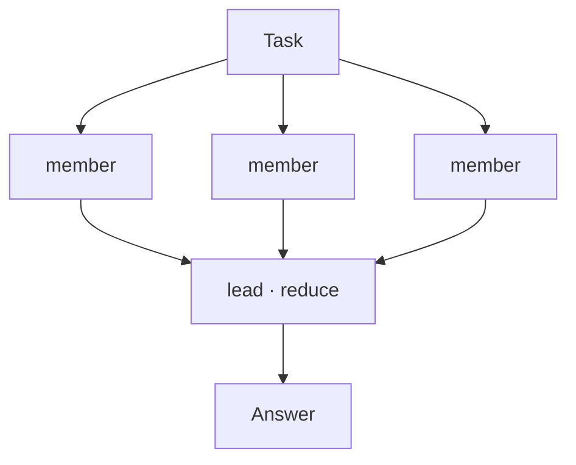

```jet
runner Fleet(model: "ollama:qwen3.6:35b-a3b",
  members: [{name: "Risks",   role: "Name the biggest risks."},
            {name: "Upside",  role: "Name the biggest benefits."},
            {name: "Skeptic", role: "Say why it might fail."}],
  reduce: "Weigh the perspectives; give one clear recommendation.")
```

**Pipeline** — 逐次的なステージ。各ステージの出力が次に渡る（`implement → test → review`）。

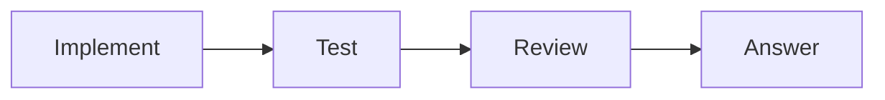

```jet
runner Pipeline(drives: "claude-code-acp", stages: [
  {name: "Implement", role: "Write the code."},
  {name: "Test",      role: "Build and test it; show the output."},
  {name: "Review",    role: "Review quality and security."}])
```

**Refine** — worker が下書きし、critic がレビュー、承認まで繰り返す（evaluator–optimizer）。

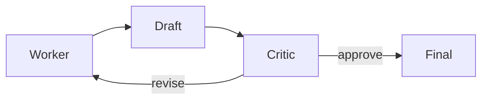

```jet
runner Refine(model: "ollama:qwen3.6:35b-a3b", max_rounds: 3,
  worker: {role: "Write a haiku for the topic. Output only the 3 lines."},
  critic: {role: "Check it is 5-7-5 and on topic; approve or return with notes."})
```

**Debate** — メンバーが複数ラウンドで対立する立場を論じ、judge が結論を出す。

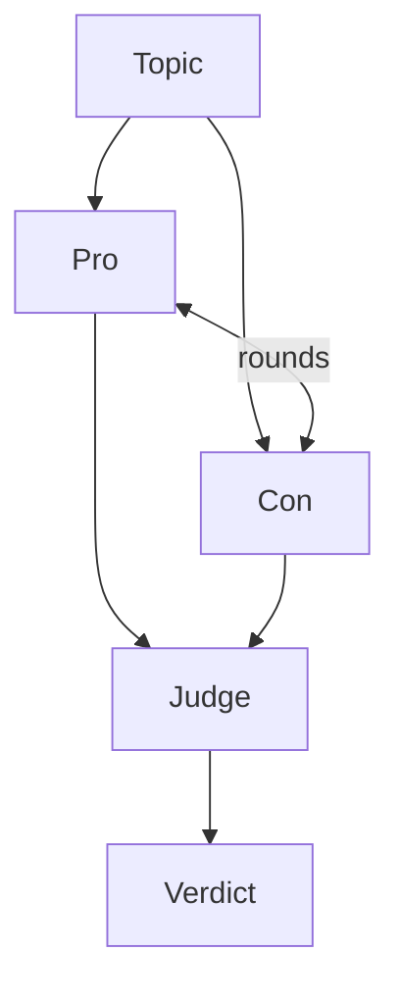

```jet
runner Debate(model: "ollama:qwen3.6:35b-a3b", rounds: 2,
  agents: [{name: "Pro", role: "Argue in favor, concretely."},
           {name: "Con", role: "Argue against, concretely."}],
  judge: {role: "Weigh both sides; give a balanced verdict."})
```

**Goal** — 試行し、安価な checker が機械的に検査できる `accept:` でゲートする。満たすまで繰り返す。

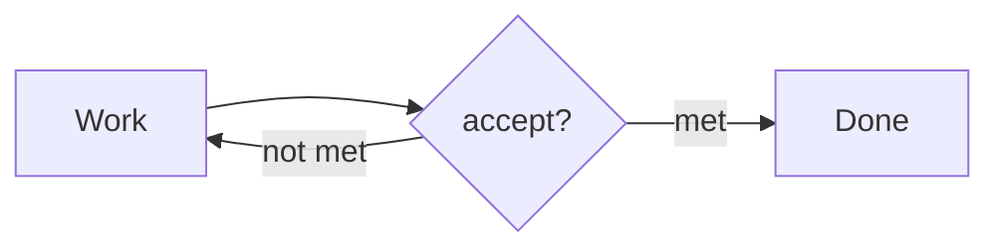

```jet
runner Goal(drives: "claude-code-acp", max_rounds: 4,
  accept: "the tests pass, shown with the real terminal output")
# 別の shape を包んで検証することも:  Goal(via: {name: :Flow}, accept: "…", max_rounds: 3)
```

**Flow** — designer がデータフローグラフを生成。独立したノードが並列に動き、sink がまとめる。

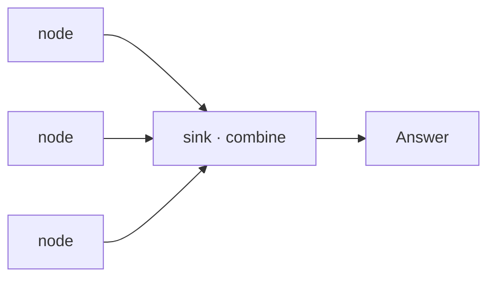

```jet
runner Flow(drives: "claude-code-acp")   # グラフは書かない — designer がタスクごとに DAG を組み立てる
```

**Auto** — router が、あらかじめ設定した shape の1つを実行時に選ぶ（各 shape に `when:` のヒントを付ける）。

```jet
runner Auto(router: "claude-code-acp", model: "ollama:qwen3.6:35b-a3b", shapes: [
  {name: :Debate, when: "a yes/no proposition to argue both sides of",
   rounds: 2,
   agents: [{name: "Pro", role: "Argue in favor, concretely."},
            {name: "Con", role: "Argue against, concretely."}],
   judge: {role: "Weigh both sides; give a balanced verdict."}},
  {name: :Fleet, when: "multi-perspective analysis of one topic",
   members: [{name: "Risks",  role: "Name the biggest risks."},
             {name: "Upside", role: "Name the biggest benefits."}],
   reduce: "Weigh the perspectives; give one clear recommendation."}])
```

**Architect** — designer が*この*タスクのためのチーム（shape + 役割）を書き、実行する。

```jet
runner Architect(drives: "claude-code-acp")   # チームは書かない — shape と役割をタスクごとに設計する
```

**Codegen** — 並列に実装し、最良を選ぶ。`workspace: :worktree` を指定した `Fleet` であり、各メンバーが自分の git worktree で同じタスクを実装し、lead が最良の diff を選ぶ。

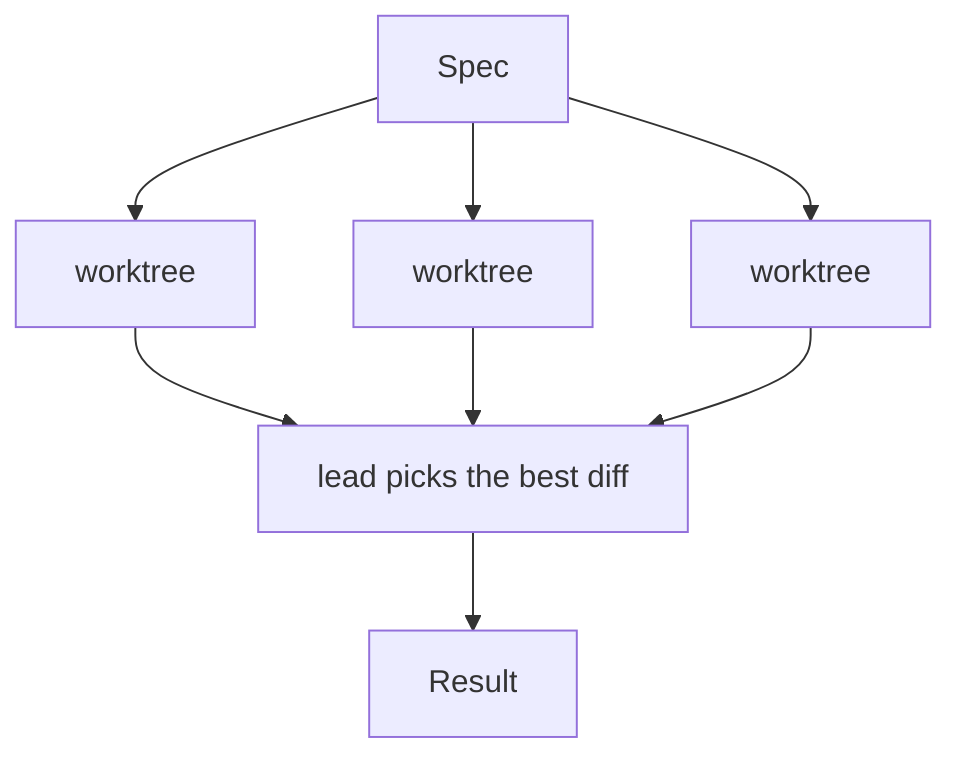

```jet
runner Fleet(drives: "claude-code-acp", workspace: :worktree, members: [
  {name: "Minimal", role: "Smallest, cleanest diff."},
  {name: "Robust",  role: "Clear naming + an edge-case check."}])
```

メタ shape（`Auto` / `Architect` / `Flow`）はトポロジーを**実行時**に決めます（LLM 駆動）。BEAM 上では生成された各ノードが監視下にあるため、幻覚やクラッシュを起こしたノードは分離され、致命的になりません — さらに `Flow` は幻覚のエッジを取り除き、サイクルを断ち切るので、生成されたグラフがデッドロックすることはありません（実地で検証済み: ローカルモデルが DB 評価タスクを 3 つの並列評価器 + 1 つの統合ノードに分解した）。

### 独自の shape を追加する

shape は、**`turn/4` 関数を持つ1つのモジュールを、1 つの `dispatch/4` の case で組み込むだけ**です — パーサ・キーワード・AST の変更は不要（`runner Name(…)` の DSL が名前を汎用的に解決する）。契約の全体:

**1. `src/jet_<name>.jet` に `turn(config, method, args, schema)` を書く** — runner の引数を読み、プロンプトを組み立て、`jet_backend` 上でオーケストレーションし、coerce した結果を返す:

```jet
module jet_pair
  # Pair: drafter が書き、reviser が一度だけ改善する。   runner Pair(model: "ollama:…")
  def self.turn(config, method, args, schema)
    jet_http_ffi::ensure_started()
    opts    = jet_backend::opts(config)                        # runner(…) の引数（map として）
    model   = maps::get(:model, opts, nil)                     # 既定のメンバーバックエンド —
    drives  = maps::get(:drives, opts, nil)                    #   ローカルモデルまたは ACP agent
    input   = jet_backend::to_bin(jet_acp::build_prompt(config, method, args))
    backend = jet_backend::resolve_lead(model, drives, nil)    # → {:ollama, m} | {:acp, cmd}

    draft = jet_backend::run_silent(backend, "Draft an answer to the task below.", input)
    final = jet_backend::run_streaming(backend,
              "Improve the draft below; reply with ONLY the improved answer.", draft)

    jet_backend::coerce(final, schema)   # `ask` → schema へ検証; `task` → TurnResult
  end
end
```

**2. 登録する** — `jet_agent::dispatch/4`（`src/jet_agent.jet`）に、他と並べて1行:

```jet
case :Pair
  jet_pair::turn(config, method, args, schema)
```

**3. 使う** — 名前は config から解決されるので、他には何も変わりません:

```jet
agent Buddy
  runner Pair(model: "ollama:qwen3.6:35b-a3b")
  ask answer(question)
end
```

それ以外はすべて基盤から無償で得られます: `jet_backend::resolve_lead` / `run_silent` /
`run_streaming` / `run_in` / `coerce`（メンバーを解決・実行し、結果を coerce）、`jet_acp::emit_trace`
と `emit_event`（RUN パネルへ供給 + 会話へストリーミング）、`erlang::spawn_monitor(fn -> … end)` に
よるクラッシュ分離された並列メンバー（`jet_fleet` / `jet_flow` を参照）、`:escalate` / `:route`
プール向けの `jet_backend::resolve_pool(opts)`。新しい shape は最小のもの、
[`jet_pipeline.jet`](../src/jet_pipeline.jet)（約 75 行、逐次）を手本にし、runner は**ドメイン中立**に
保つ（構造のみ — 成果物はタスク次第）。基盤の詳細を含む完全な解説:
[agent_design.md §6.7](agent_design.md#67-adding-your-own-shape)。

---

## 4. ネイティブ agent 機能

インプロセスの `Llm` runner 向けに、Jet は agent の内部ループをネイティブに実装しています（外部フレームワークなし）。これらは実際に配線された機能で、[`examples/`](../examples) 以下に実行可能な例があります。ただし、まだ自動テストスイートはなく、結果の品質はモデルに依存します。

### メモリ

```jet
agent Assistant
  model "ollama:qwen3.6:35b-a3b"
  memory "demo-durable-ada"          # 永続化 id -> 会話が再起動をまたいで残る
  ask chat(message) -> {reply: String}
end
```

`memory` がなければ、スレッドはそのセッションの間だけ会話をメモリに保持します。`memory "id"` を付けると、ディスクに永続化されます。バイト予算により最近のターンを残し、古いものは圧縮するので、コンテキストウィンドウが溢れません。→ [`agent_memory_demo.jet`](../examples/agent_memory_demo.jet)、[`agent_memory_durable_demo.jet`](../examples/agent_memory_durable_demo.jet)。

### スキル（progressive disclosure）

```jet
agent Concierge
  model "ollama:qwen3.6:35b-a3b"
  skills "examples/skills"           # SKILL.md ファイルのディレクトリ
  ask handle(request) -> {reply: String}
end
```

各スキルは front-matter（`name`、`description`）付きの `SKILL.md` です。最初にモデルへ見せるのはカタログ（名前 + 説明）だけで、スキルの本文はモデルが要求したときに**オンデマンド**で読み込まれます — progressive disclosure。→ [`agent_skill_demo.jet`](../examples/agent_skill_demo.jet)。

### ツール

（上記の）`tool`/`mcp` に加えて、標準ライブラリはネイティブな tool ライブラリを同梱します — Node 不要:

| ライブラリ | 関数 |
|------|------|
| `jet_fs` | `read` · `write` · `edit` · `list` · `grep` |
| `jet_web` | `fetch(url)`（HTML → テキスト）· `search(query)`（DuckDuckGo、API キー不要） |

### プランニング

```jet
runner Plan(model: "ollama:qwen3.6:35b-a3b")          # plan → ステップを実行
runner Plan(via: {name: :Fleet})                       # 各ステップを sub-shape で実行
```

`Plan` runner は計画を立ててステップを実行し、失敗時にはリトライ/再計画します。

---

## 5. 動的モデル選択

単一の `model:` の代わりに、反復的な shape（`Goal`、`Refine`）に、tier 順に並べた **`models:`** プールと **`select:`** モードを与えます。プールは Ollama モデルや ACP agent を自由に組み合わせられます。

| `select:` | 仕組み | いつ使うか |
|---|---|---|
| `:static`（既定） | 単一の `model:` / `drives:` | 分かっている単一のタスク |
| `:escalate` | ラウンド N でプールの N 番目のモデルを使う。チェックに失敗すると次の試行をより強力なモデルにエスカレート（安価優先のカスケード） | リトライループでのコスト + 信頼性 |
| `:route` | 安価な router が各モデルのプロフィールを読み、タスクごとに**一度だけ**最適なものを選ぶ | 多様なタスク / 特化したモデル |

```jet
runner Goal(
  models: [
    {name: "ollama:qwen3.6:35b-a3b", tier: :cheap},
    {name: "claude",                 tier: :strong}],
  select: :escalate, max_rounds: 3, accept: "tests pass")
```

ルーティングはコストだけでなく**適合度**で行います: router は各モデルの完全なプロフィール — あなたが付けた任意のメタデータ（`tier`、`lang`、`good_at`、`context`、…） — を見て、タスクに合わせます。

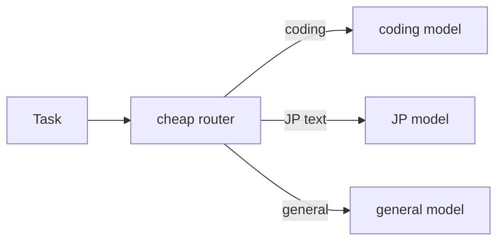

---

## 6. その他の機能

- **ACP サーバ** — `jet acp-serve Module::Agent::method file.jet` は任意の agent を ACP（stdio）で公開します。応答はストリーミングされ、セッションは記憶し、plan/tool 呼び出しはネイティブに描画されます。ACP クライアントやスクリプトから駆動できます。
- **ネイティブ Claude Code バックエンド** — `drives "claude"` は `claude` CLI を直接駆動します（ヘッドレスの stream-json）: ストリーミング、スラッシュコマンド、モデル/effort の選択、auto モード、そして Console の承認 UI への権限ブリッジ — アダプタなし。
- **Git worktree 分離** — スレッド（や `Codegen` の候補）は各自の git worktree で動けるので、並列作業が互いを壊しません。
- **エフェクト宣言** — `needs` / `platform` がエフェクト（例: `Console`）を宣言・注入します。
- **エラー処理** — `try` / `catch` / `finally`。捕捉される値は例外の map（`:class` / `:reason` / `:stacktrace`）です。

---

## アーキテクチャ

**コンパイラパイプライン:** Jet ソース → Lexer → Token filter → Parser → AST → Rebind pass → Codegen（FFI 経由の Erlang 構文木）→ BEAM バイトコード。Gleam で書かれ、BEAM をターゲットにします。

**Agent ランタイム:**

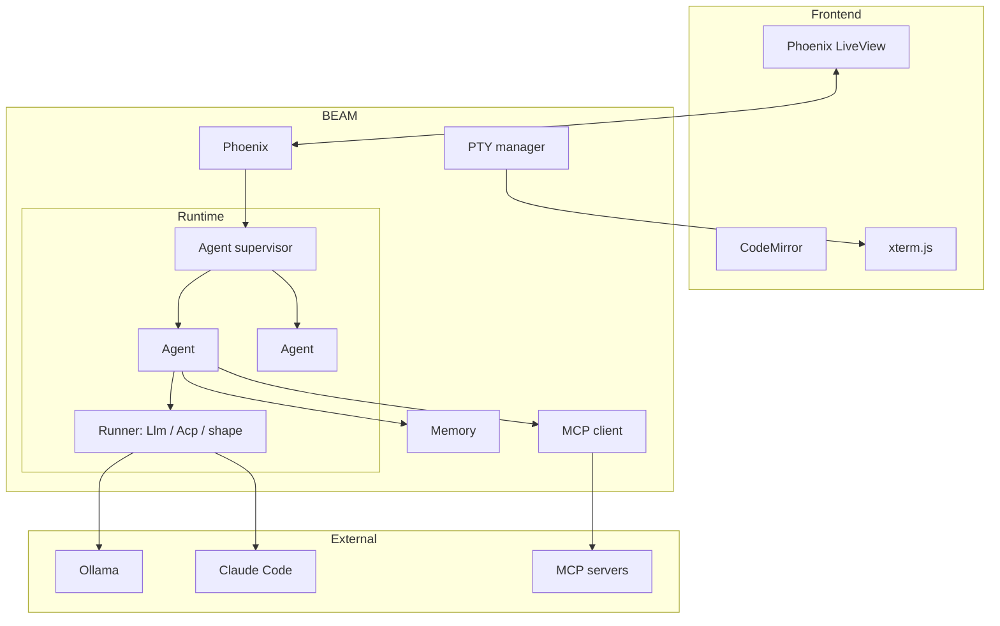

Jet **も** Phoenix も BEAM 上で動くので、Console 全体は Erlang ランタイムを焼き込んだ 1 つの OTP リリース（または単一の Burrito バイナリ）として配布できます。

---

## FAQ

**ローカル LLM を使うには？** Ollama をインストールしてモデルを pull し、`model "ollama:<model>"` で指定します — API キー不要。Jet Console は Settings でインストール済みモデルを自動検出します。

**Claude Code を使うには？** `drives "claude-code-acp"`（ACP アダプタ経由）または `drives "claude"`（CLI を直接駆動）。プライベートリポジトリや認証は CLI 自身のログインに従います。

**agent を並列に動かすには？** shape（`Fleet`、`Flow`、…）を使うか、BEAM の並行性を直接使います — 各 agent はプロセスです。Console では各スレッドが独立し、ボードでそれらを一度に表示します。

**agent の出力を検証するには？** 機械的に検査できる `accept:` 条件（例: テストコマンド）を付けた `Goal` を使います。チェックが通るまで（`max_rounds` まで）ループします。

**危険な操作を防ぐには？** `approve do |req| … end` ブロックが各権限リクエストをゲートします（`:allow` / `:deny`）。Console ではリクエストが 🔐 プロンプトとして現れます。
