**English** | [日本語](features.ja.md)

# Jet — Feature Guide

Jet is a dynamically-typed, OOP-functional language with Ruby-like syntax that compiles to BEAM
(Erlang VM) bytecode. Its headline idea:

> **`object = actor = agent`** — one object model and one call syntax (`x.method()`) spanning a
> local value → a supervised concurrent process → an AI agent.

This is a practical tour of the features. Deeper references: the language + agent overview in the
[README](../README.md); agent internals in [agent_design.md](agent_design.md); the ACP wire
protocol in [acp_sequence.md](acp_sequence.md); the web UI in [console/README.md](../console/README.md).

---

## Contents

1. [Quickstart](#quickstart)
2. [Jet Console — a Phoenix LiveView UI](#1-jet-console--a-phoenix-liveview-ui)
3. [The agent system](#2-the-agent-system)
4. [Collaboration shapes (multi-agent patterns)](#3-collaboration-shapes-multi-agent-patterns)
5. [Native agent features (memory · skills · tools · planning)](#4-native-agent-features)
6. [Dynamic model selection](#5-dynamic-model-selection)
7. [Other features](#6-other-features)
8. [Architecture](#architecture)
9. [FAQ](#faq)

---

## Quickstart

### Prerequisites

- **Erlang/OTP ≥ 26** and **Gleam ≥ 1.0** — to build the compiler.
- **Elixir ~> 1.15** — for Jet Console (it brings Erlang/OTP; not needed if you use a prebuilt binary).
- Optional: **Ollama** (local models, no API key) and/or a `claude` CLI / `claude-code-acp` (external agents).

### Build the compiler

```sh
git clone https://github.com/i2y/jet.git && cd jet
gleam build
gleam export erlang-shipment && escript build_escript.erl
./jet --help
```

### CLI

```sh
./jet Foo.jet                                  # compile to Foo.beam
./jet -r Module::func Foo.jet                  # compile + run a module function
./jet acp-serve Module::Agent::method Foo.jet  # expose an agent over ACP (stdio)
./jet build src/                               # compile a directory
./jet escript MyApp src/                       # bundle a standalone executable (needs Erlang on the target)
./jet release MyApp src/                       # an OTP release
```

### Run the web UI (Jet Console)

```sh
cd console && mix setup                                   # deps + esbuild/tailwind (no Node)
( cd .. && for f in src/*.jet; do ./jet "$f"; done )      # compile the Jet stdlib beams once
mix phx.server                                            # → http://localhost:4000
```

Or a **prebuilt single binary** — no Elixir/Erlang on the machine, no env vars:

```sh
./console/burrito_out/jc_macos start   # (jc_linux / jc_windows.exe) → http://localhost:4000
```

### Your first agent

```jet
# hello.jet
module hello
  agent Greeter
    model "ollama:qwen3.6:35b-a3b"     # a local model — no API key
    role "You are a friendly assistant. Be concise."
    ask greet(name) -> {greeting: String}
  end
end
```

Pick it in **Jet Console**, or expose it to any [ACP](https://agentclientprotocol.com) client:

```sh
./jet acp-serve hello::Greeter::greet hello.jet
```

---

## 1. Jet Console — a Phoenix LiveView UI

A browser UI for Jet agents — **pure BEAM, no Node, no Electron**. Projects, parallel threads, a
markdown conversation, a live plan + tool-activity panel, an embedded terminal, and a file
viewer/editor.


### System architecture

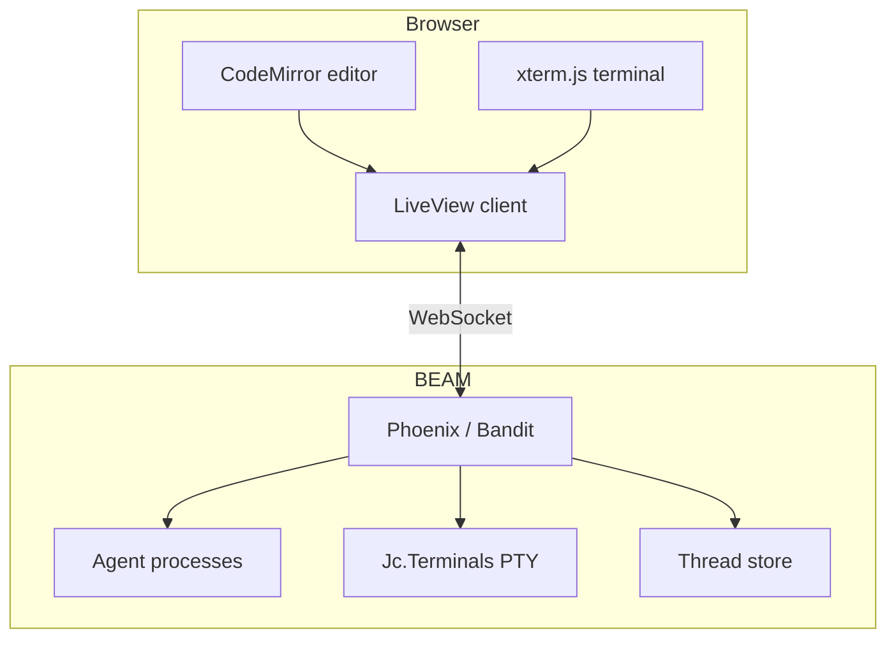

### Key features

| Feature | Description |
|------|------|
| **Projects** | Open a folder as a project (or type `owner/repo` to clone it with `gh`). Open a brand-new directory and it's created. |
| **Parallel threads** | Each thread drives its own agent (a local model, an ACP agent, **or** the native Claude CLI); switch/create freely. Threads + conversation **persist** across reloads and server restarts — a turn in flight survives a reload. |
| **Backend per thread** | Pick the backend from the catalog; each thread is independent. |
| **No-code agent builder** | Compose / edit / delete agents in the 🤖 Agents panel; **Save** recompiles the `.jet` file and hot-loads it — no restart. |
| **Parallel-threads board** | A grid of thread cards, each with its live plan/tool structure. |
| **Git worktree isolation** | Isolate a thread in its own git worktree (🌳) for conflict-free parallel work. |
| **Interactive approvals** | Tool-permission requests surface as 🔐 Allow/Deny prompts. |
| **Notifications, dark/light theme, stop/cancel** | Completion notifications (even from a background tab); theme toggle; stop a running turn. |

### Built-in agents (catalog)

| Agent | What it does | Backend |
|--------------|------|-------------|
| Local Assistant | general assistant | Ollama |
| Jet Coder | edits files | Ollama |
| Jet Researcher | web research | Ollama + `jet_web` |
| Claude Code (ACP) | drive Claude Code via the ACP adapter | ACP |
| Claude Code (native CLI) | drive the `claude` CLI **directly** (no adapter) | native |
| Jet Forge (Goal+Architect) | verify-until-proven; designs the team per task | Claude (ACP **or** native) |
| Jet Verified Coder (Goal+Flow) | code, verified against an acceptance check | Claude (ACP **or** native) |
| Routed | cheap / strong local model, routed by task | Ollama pool |

### Creating a custom agent

An agent is a handful of declarations (each covered in [§2](#2-the-agent-system)); the Console picks
it up via a small catalog convention. Whether you write the file by hand or use the browser builder,
**Save recompiles and hot-loads it — no server restart.**

#### A realistic example — a file-editing coding agent

A local, node-free agent with a role, typed tools it can call, a per-turn tool budget, and an
approval policy that blocks dangerous shell commands (adapted from
[`examples/agent_coder_demo.jet`](../examples/agent_coder_demo.jet)):

```jet
# agents/my_agents.jet
module my_agents
  agent Coder
    model "ollama:qwen3.6:35b-a3b"        # local model (or `drives "claude"` for the Claude CLI)
    tool_fuel 25                           # max tool calls per turn — coding needs many rounds
    role "You are a coding assistant working under /tmp/sandbox. Use read_file / write_file / edit_file / list_dir there, and `run` for shell commands. Verify by re-reading. Be concise."

    tool read_file(path: String) do |p|              # typed params become the tool's JSON schema
      jet_fs::read(p)
    end
    tool write_file(path: String, content: String) do |p, c|
      jet_fs::write(p, c)
    end
    tool edit_file(path: String, old: String, new: String) do |p, o, n|
      jet_fs::edit(p, o, n)
    end
    tool list_dir(path: String) do |p|
      jet_fs::list(p)
    end
    tool run(command: String) do |c|                 # a shell escape hatch — gated below
      os::cmd(erlang::binary_to_list(erlang::iolist_to_binary(["cd /tmp/sandbox && ", c])))
    end

    # gate each tool call: deny dangerous shell commands (rm/sudo/curl/…); the file tools pass
    approve do |req|
      jet_policy::gate(req, <<"run">>, {|r| jet_policy::deny_tokens(r, jet_policy::default_deny())})
    end

    ask code(task)                         # a (typed) answer; use `task m(args)` for a TurnResult
  end
  # … catalog/0 + spawn_for/1 below …
end
```

**What each part does**

| declaration | role |
|---|---|
| `model "ollama:…"` / `drives "claude"` | the backend — a local model, or an external/native Claude agent |
| `role "…"` | the system prompt |
| `ask m(args) -> Schema` | a call returning a **schema-validated** value |
| `task m(args)` | a call returning a **`TurnResult`** (`.text` / `.edits` / `.commands` / …) |
| `tool name(p: Type) do \|p\| … end` | a callable tool; its typed params become the JSON schema the model fills. Bare `tool name` = a peer with no local impl. |
| `tool_fuel N` | cap on tool calls per turn (the agentic loop's budget) |
| `approve do \|req\| … end` | gate each tool/permission request (`:allow`/`:deny`); `jet_policy` has ready-made allow/deny-list policies |
| `mcp "npx …"` | pull in an external MCP server's tools |
| `memory "id"` · `skills "dir"` | durable conversation memory · progressive-disclosure skills |
| `runner Shape(…)` | use a multi-agent [shape](#3-collaboration-shapes-multi-agent-patterns) instead of a single `model`/`drives` |

#### Show it in the Console picker

Every file under `agents/` exports `catalog/0` (the picker entries) and `spawn_for/1` (a key → a
spawned agent); the Console aggregates them all:

```jet
  def self.catalog()
    [{:coder, "My Coder (local)"}]
  end

  def self.spawn_for(key)
    match key
      case :coder
        my_agents::Coder.spawn()           # agents are referenced module-qualified
      case _
        nil
    end
  end
```

#### The no-code builder & hot reload

In the 🤖 **Agents** panel you can build the same agent from a form (name, role, backend, tools,
shape — no code), tweak **backend settings**, or edit the raw **`.jet`**. In every case **Save
recompiles the file with the `jet` escript and hot-loads the new beam into the picker — no server
restart** (`Jc.AgentStore` does the compile/load/CRUD; builder agents go to `custom_agents.jet`;
`agents/builtin.jet` seeds the built-ins). Drop a new `agents/*.jet` and Save — it's in the picker
immediately.

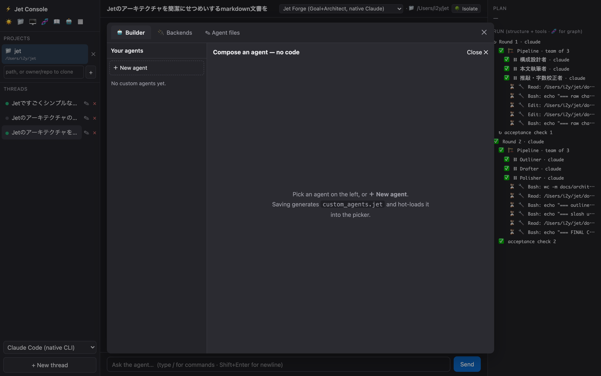

### Browser-side components

**File viewer / editor** — browse the project (or a thread's git worktree) in a tree, edit in
CodeMirror 5 with syntax highlighting, and get **rendered previews**: Markdown and **HTML** (in a
sandboxed iframe), inline images, a "too large" guard for >2 MB files, and a 👁 Preview / ✎ Source
toggle. Below, `README.md` is shown as a rendered preview:

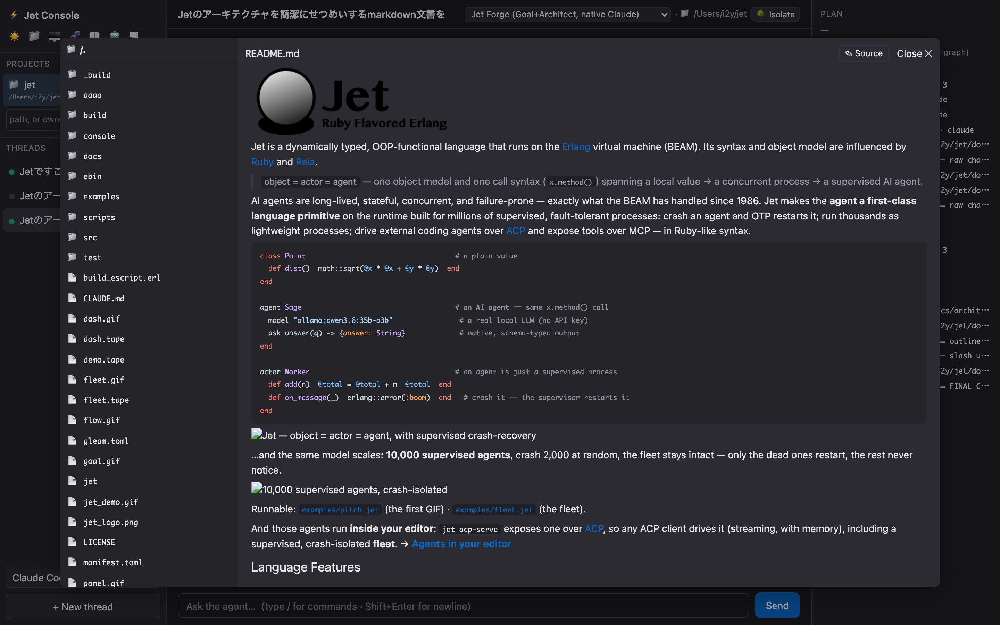

**Embedded terminal** — xterm.js plus a PTY owned by a supervised `Jc.Terminals` GenServer, so a
terminal (and any long-running command) **survives a browser reload**. It is **per thread**, opened
in that thread's cwd (project or worktree), docked below the conversation, and follows the pane
width live:

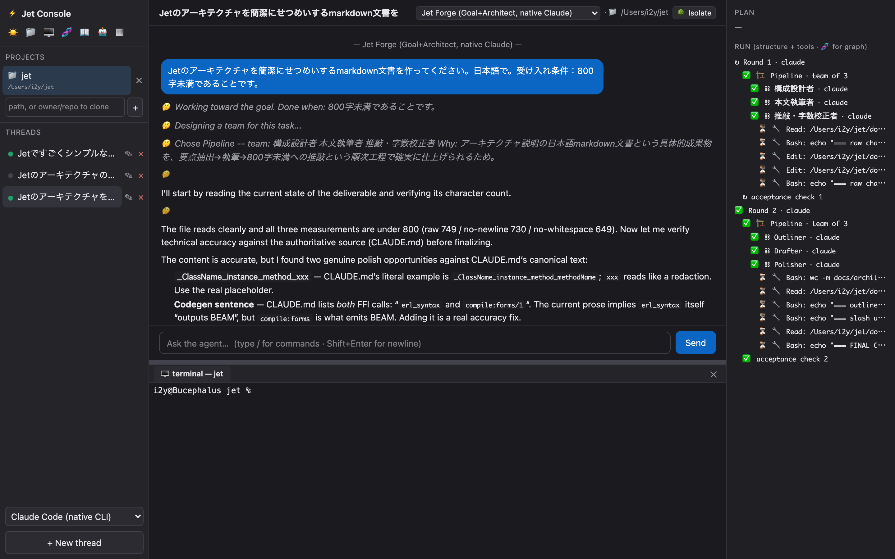

**Parallel-threads board** — a grid of thread cards; each shows its agent, status, and live
plan/tool structure, so you can watch several agents work at once:

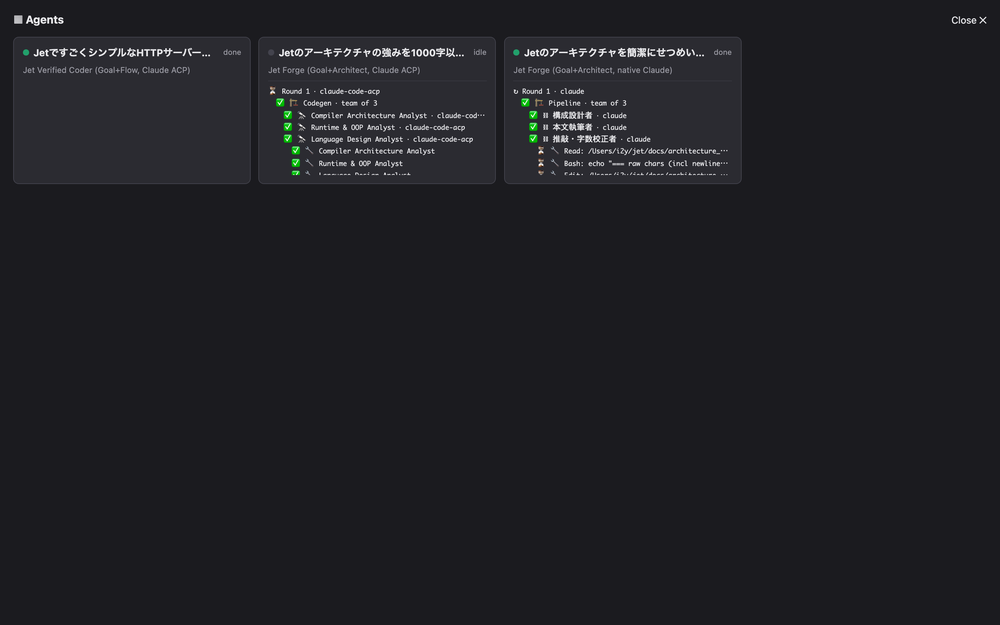

**Rich chat** — highlight.js code blocks, **Mermaid** diagrams, streaming token-by-token responses,
and colored diffs when an agent edits files.

### Packaging

| Form | Size | Notes |
|------|--------|------|
| **OTP release** | ~35 MB | self-contained, ERTS bundled |
| **Single binary (Burrito)** | ~17–32 MB/OS | one self-extracting file per OS (macOS/Linux/Windows); `console/build_binary.sh <target>` |

The binary runs with **no environment variables** (`./jc_macos start`) — it generates + persists a
secret on first run, defaults to `localhost:4000`, and serves. Set `JET_CONSOLE_BIND_ALL=1` to
expose it on the LAN, `PORT=…` for another port.

---

## 2. The agent system

The `agent` keyword backs an object with an LLM/agent runtime. An `agent` desugars to an `actor`
(a supervised OTP process) plus a pluggable **runner**; calls are **async** (they return a
`Future` — `.await()` / `.stream do |ev|`).

```jet
agent Researcher
  model "ollama:qwen3.6:35b-a3b"
  role "You research rigorously and cite sources."
  ask research(question) -> {answer: String, sources: [String]}
  tool web_search
end
```

### `ask` vs `task`

| Kind | Returns | Use for |
|------|--------|------------|
| `ask m(args) -> Type` | a typed, schema-validated value | analysis, Q&A, structured extraction |
| `task m(args)` | a `TurnResult` (`.text` / `.ok?` / `.edits` / `.commands` / `.plan` / `.files`) | code changes, file/command work |

### Backends

| Declaration | Runner | Description |
|------|---------|------|
| `model "ollama:…"` | `Llm` | a local model, run in-process on the BEAM |
| `drives "claude-code-acp"` | `Acp` | drive an external agent over [ACP](https://agentclientprotocol.com) (Claude Code, Codex, Gemini, …) |
| `drives "claude"` | native | drive the Claude Code CLI **directly**, no adapter |

### Tools

```jet
agent FileHelper
  model "ollama:qwen3.6:35b-a3b"
  tool read_file(path: String) do |p|      # typed params + an implementation block
    jet_fs::read(p)
  end
  tool web_search                           # bare — a declared peer/tool with no local impl
  ask help(request) -> String
end
```

### Approval policy

```jet
agent SafeAgent
  model "ollama:qwen3.6:35b-a3b"
  approve do |req|
    match req.get(:kind)
      case "execute"
        :deny                               # never run commands
      case _
        :allow
    end
  end
  task work(request)
end
```

### MCP client

An agent can **consume** external MCP servers — their tools become callable mid-turn:

```jet
agent Echoer
  model "ollama:qwen3.6:35b-a3b"
  mcp "npx -y @modelcontextprotocol/server-everything"
  tool_fuel 25                              # cap total tool calls per turn (loop guard)
  ask say(text) -> {reply: String}
end
```

Jet also speaks MCP as a **server** (`jet_mcp::handle` answers `tools/list` / `tools/call`).

---

## 3. Collaboration shapes (multi-agent patterns)

Every shape is a **runner module + one dispatch line** over a shared substrate (`jet_backend`).
They all inherit, for free: members run as **monitored BEAM processes** (crash-isolated — kill
one, the rest still deliver), output **streams**, each is **ACP-servable**, and the backend is the
**user's choice** (a local model or any ACP agent).

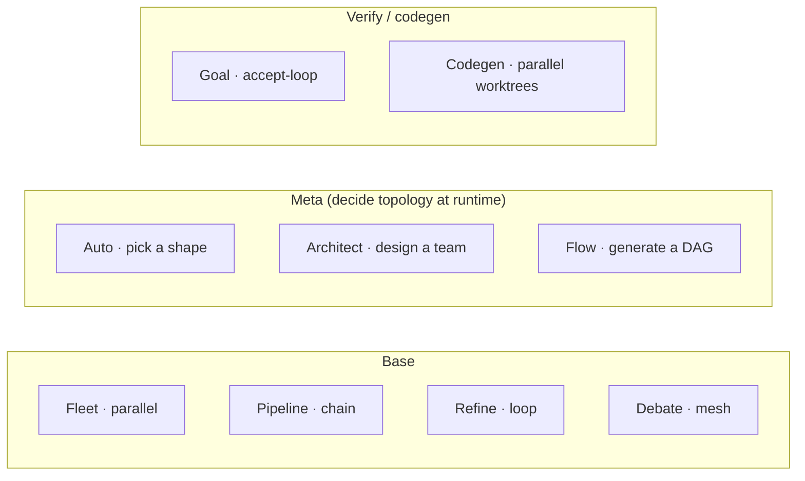

| runner | topology | what it does |
|---|---|---|
| `Fleet` | star · parallel | N members analyze in parallel; a lead synthesizes (mixture-of-agents) |
| `Pipeline` | chain | sequential stages (`implement → test → review`) |
| `Refine` | loop | a worker drafts, a critic reviews, repeat until approved |
| `Debate` | mesh | members argue opposing sides over rounds; a judge concludes |
| `Auto` | router | a router picks the best shape at runtime |
| `Architect` | self-generating | designs the team (shape + roles) for the task, then runs it |
| `Flow` | generated DAG | generates a dataflow graph; independent nodes run in parallel |
| `Goal` | verify-loop | attempt until a machine-checkable `accept:` condition is met |
| `Codegen` | parallel worktrees | N agents implement the same task in their own git worktrees; the lead picks the best |

### Each shape

> Each block below shows only the shape's `runner` line — drop it into an `agent … / ask · task … / end` (see [§2](#2-the-agent-system)) to run it.

**Fleet** — N members analyze the same task in parallel; a lead synthesizes (mixture-of-agents).

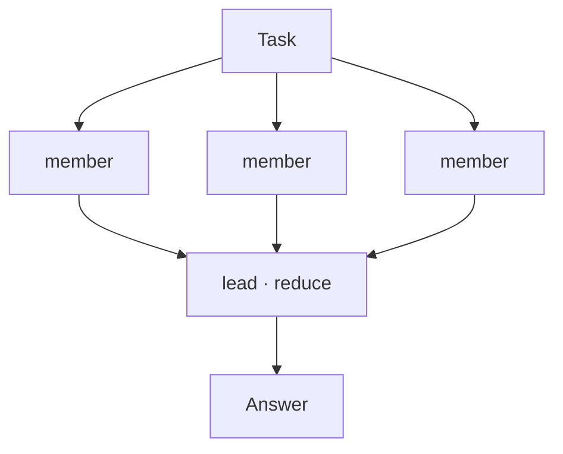

```jet
runner Fleet(model: "ollama:qwen3.6:35b-a3b",
  members: [{name: "Risks",   role: "Name the biggest risks."},
            {name: "Upside",  role: "Name the biggest benefits."},
            {name: "Skeptic", role: "Say why it might fail."}],
  reduce: "Weigh the perspectives; give one clear recommendation.")
```

**Pipeline** — sequential stages; each stage's output feeds the next (`implement → test → review`).

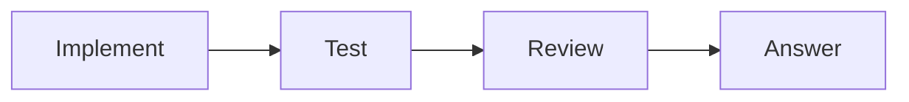

```jet
runner Pipeline(drives: "claude-code-acp", stages: [
  {name: "Implement", role: "Write the code."},
  {name: "Test",      role: "Build and test it; show the output."},
  {name: "Review",    role: "Review quality and security."}])
```

**Refine** — a worker drafts, a critic reviews, repeat until approved (evaluator–optimizer).

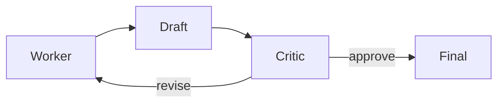

```jet
runner Refine(model: "ollama:qwen3.6:35b-a3b", max_rounds: 3,
  worker: {role: "Write a haiku for the topic. Output only the 3 lines."},
  critic: {role: "Check it is 5-7-5 and on topic; approve or return with notes."})
```

**Debate** — members argue opposing sides over rounds; a judge concludes.

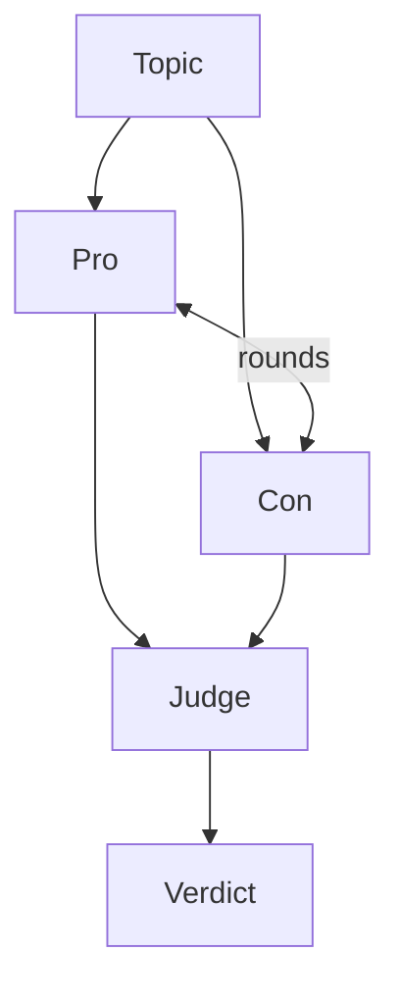

```jet
runner Debate(model: "ollama:qwen3.6:35b-a3b", rounds: 2,
  agents: [{name: "Pro", role: "Argue in favor, concretely."},
           {name: "Con", role: "Argue against, concretely."}],
  judge: {role: "Weigh both sides; give a balanced verdict."})
```

**Goal** — attempt, then a cheap checker gates on a machine-checkable `accept:`; repeat until met.

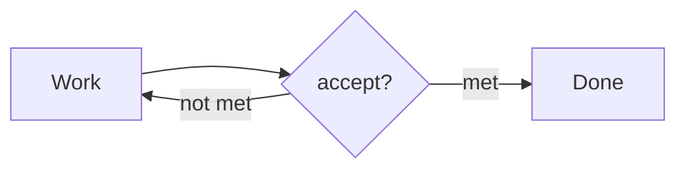

```jet
runner Goal(drives: "claude-code-acp", max_rounds: 4,
  accept: "the tests pass, shown with the real terminal output")
# or wrap another shape to verify it:  Goal(via: {name: :Flow}, accept: "…", max_rounds: 3)
```

**Flow** — a designer generates a dataflow graph; independent nodes run in parallel, a sink combines.

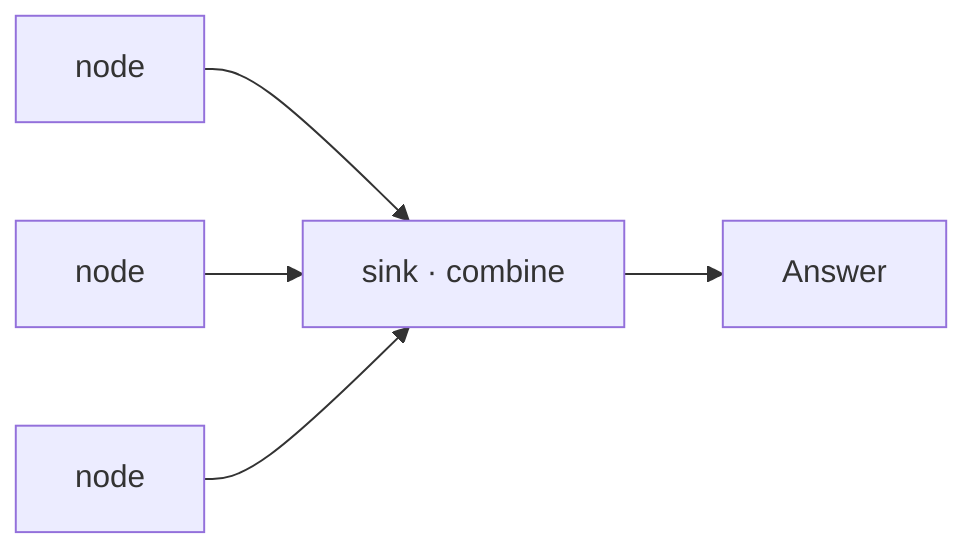

```jet
runner Flow(drives: "claude-code-acp")   # you write no graph — the designer builds the DAG per task
```

**Auto** — a router picks one of your pre-configured shapes at runtime (each with a `when:` hint).

```jet
runner Auto(router: "claude-code-acp", model: "ollama:qwen3.6:35b-a3b", shapes: [
  {name: :Debate, when: "a yes/no proposition to argue both sides of",
   rounds: 2,
   agents: [{name: "Pro", role: "Argue in favor, concretely."},
            {name: "Con", role: "Argue against, concretely."}],
   judge: {role: "Weigh both sides; give a balanced verdict."}},
  {name: :Fleet, when: "multi-perspective analysis of one topic",
   members: [{name: "Risks",  role: "Name the biggest risks."},
             {name: "Upside", role: "Name the biggest benefits."}],
   reduce: "Weigh the perspectives; give one clear recommendation."}])
```

**Architect** — a designer writes the team (shape + roles) for *this* task, then runs it.

```jet
runner Architect(drives: "claude-code-acp")   # you write no team — it designs the shape + roles per task
```

**Codegen** — parallel implementations, then pick the best. It is `Fleet` with `workspace:
:worktree`, so each member implements the same task in its own git worktree and the lead picks the best diff.

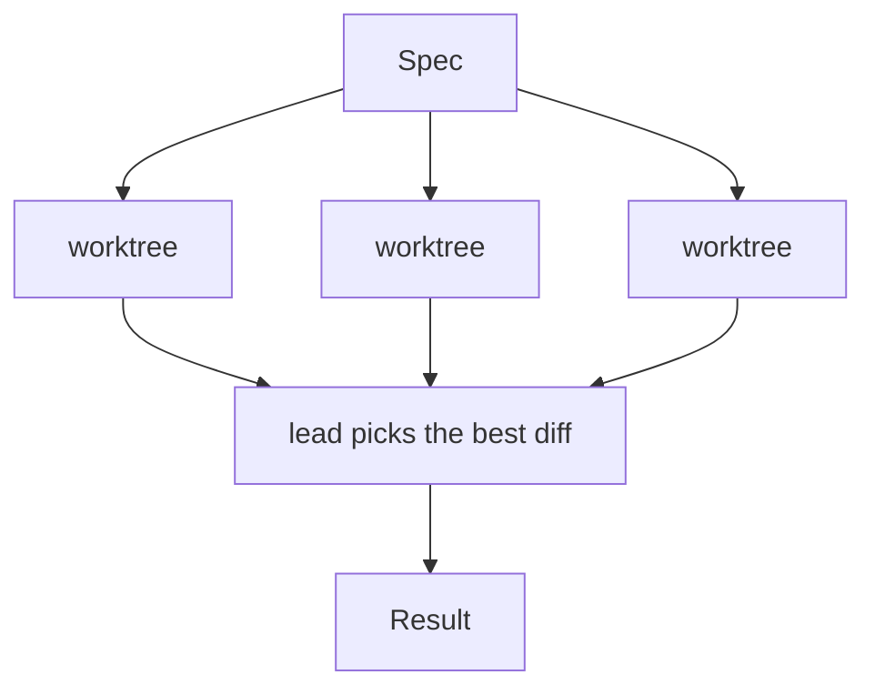

```jet
runner Fleet(drives: "claude-code-acp", workspace: :worktree, members: [
  {name: "Minimal", role: "Smallest, cleanest diff."},
  {name: "Robust",  role: "Clear naming + an edge-case check."}])
```

The meta-shapes (`Auto` / `Architect` / `Flow`) decide the topology **at runtime** (LLM-driven);
on the BEAM each generated node is supervised, so a hallucinated/crashing node is isolated, not
fatal — and `Flow` even cleans hallucinated edges and breaks cycles so a generated graph can't
deadlock (validated live: a local model decomposed a DB-evaluation task into three parallel
evaluators + a synthesis node).

### Adding your own shape

A shape is **one module with a `turn/4` function, wired in with one `dispatch/4` case** — no parser,
keyword, or AST change (the `runner Name(…)` DSL resolves the name generically). The whole contract:

**1. Write `src/jet_<name>.jet` with `turn(config, method, args, schema)`** — read the runner args,
build the prompt, orchestrate over `jet_backend`, return the coerced result:

```jet
module jet_pair
  # Pair: a drafter writes, then a reviser improves it once.   runner Pair(model: "ollama:…")
  def self.turn(config, method, args, schema)
    jet_http_ffi::ensure_started()
    opts    = jet_backend::opts(config)                        # the runner(…) args, as a map
    model   = maps::get(:model, opts, nil)                     # default member backend —
    drives  = maps::get(:drives, opts, nil)                    #   a local model OR an ACP agent
    input   = jet_backend::to_bin(jet_acp::build_prompt(config, method, args))
    backend = jet_backend::resolve_lead(model, drives, nil)    # → {:ollama, m} | {:acp, cmd}

    draft = jet_backend::run_silent(backend, "Draft an answer to the task below.", input)
    final = jet_backend::run_streaming(backend,
              "Improve the draft below; reply with ONLY the improved answer.", draft)

    jet_backend::coerce(final, schema)   # `ask` → validate to the schema; `task` → a TurnResult
  end
end
```

**2. Register it** — one line in `jet_agent::dispatch/4` (`src/jet_agent.jet`), beside the others:

```jet
case :Pair
  jet_pair::turn(config, method, args, schema)
```

**3. Use it** — the name resolves from the config, so nothing else changes:

```jet
agent Buddy
  runner Pair(model: "ollama:qwen3.6:35b-a3b")
  ask answer(question)
end
```

Everything else is free from the substrate: `jet_backend::resolve_lead` / `run_silent` /
`run_streaming` / `run_in` / `coerce` (resolve a member, run it, coerce the result);
`jet_acp::emit_trace` and `emit_event` (feed the RUN panel + stream the conversation);
`erlang::spawn_monitor(fn -> … end)` for crash-isolated parallel members (see `jet_fleet` /
`jet_flow`); and `jet_backend::resolve_pool(opts)` for `:escalate` / `:route` pools. Model a new
shape on the smallest one, [`jet_pipeline.jet`](../src/jet_pipeline.jet) (~75 lines, sequential), and
keep the runner **domain-neutral** (structure only — the deliverable is whatever the task needs).
Full walkthrough with the substrate details: [agent_design.md §6.7](agent_design.md#67-adding-your-own-shape).

---

## 4. Native agent features

For the in-process `Llm` runner, Jet implements the agent inner loop natively (no external
framework). These are real, wired features with runnable examples under [`examples/`](../examples);
there is no automated test suite for them yet, and result quality is model-dependent.

### Memory

```jet
agent Assistant
  model "ollama:qwen3.6:35b-a3b"
  memory "demo-durable-ada"          # a persistence id -> the conversation survives restarts
  ask chat(message) -> {reply: String}
end
```

Without `memory`, a thread keeps its conversation in memory for the session. With a `memory "id"`,
it is persisted to disk. A byte budget keeps recent turns and compacts older ones so the context
window doesn't overflow. → [`agent_memory_demo.jet`](../examples/agent_memory_demo.jet),
[`agent_memory_durable_demo.jet`](../examples/agent_memory_durable_demo.jet).

### Skills (progressive disclosure)

```jet
agent Concierge
  model "ollama:qwen3.6:35b-a3b"
  skills "examples/skills"           # a directory of SKILL.md files
  ask handle(request) -> {reply: String}
end
```

Each skill is a `SKILL.md` with front-matter (`name`, `description`). Only the catalog (names +
descriptions) is shown to the model up front; the full body of a skill is loaded **on demand** when
the model asks for it — progressive disclosure. → [`agent_skill_demo.jet`](../examples/agent_skill_demo.jet).

### Tools

Beyond `tool`/`mcp` (above), the stdlib ships native tool libraries — no Node:

| Library | Functions |
|------|------|
| `jet_fs` | `read` · `write` · `edit` · `list` · `grep` |
| `jet_web` | `fetch(url)` (HTML → text) · `search(query)` (DuckDuckGo, no API key) |

### Planning

```jet
runner Plan(model: "ollama:qwen3.6:35b-a3b")          # plan → execute steps
runner Plan(via: {name: :Fleet})                       # each step run by a sub-shape
```

The `Plan` runner drafts a plan and executes the steps, with retry/re-planning on failure.

---

## 5. Dynamic model selection

Instead of one `model:`, give an iterative shape (`Goal`, `Refine`) a tier-ordered **`models:`**
pool plus a **`select:`** mode. The pool is your choice of Ollama models and/or ACP agents.

| `select:` | mechanism | when |
|---|---|---|
| `:static` (default) | one `model:` / `drives:` | a single known task |
| `:escalate` | round N uses the Nth pool model; a failed check escalates the next attempt to a stronger model (cheap-first cascade) | cost + reliability on a retry loop |
| `:route` | a cheap router reads each model's profile and picks the best fit **once** per task | heterogeneous tasks / specialised models |

```jet
runner Goal(
  models: [
    {name: "ollama:qwen3.6:35b-a3b", tier: :cheap},
    {name: "claude",                 tier: :strong}],
  select: :escalate, max_rounds: 3, accept: "tests pass")
```

Routing is by **fit**, not just cost: the router sees each model's full profile — any metadata you
attach (`tier`, `lang`, `good_at`, `context`, …) — and matches it to the task.

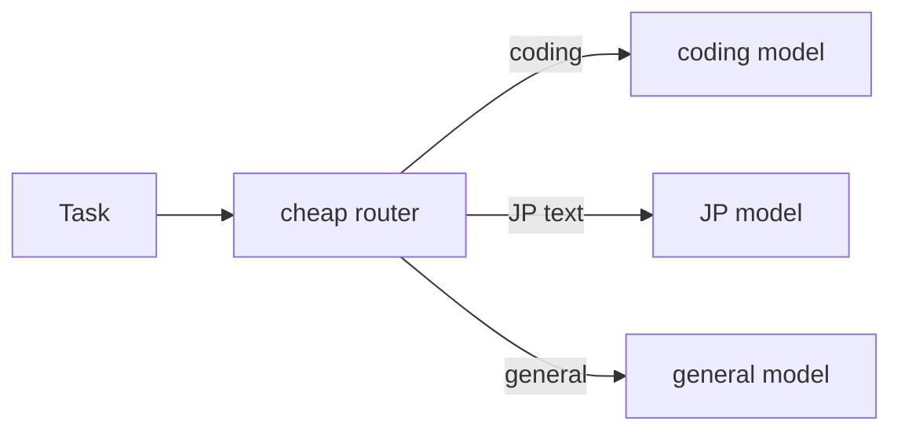

---

## 6. Other features

- **ACP server** — `jet acp-serve Module::Agent::method file.jet` exposes any agent over ACP
  (stdio); replies stream, the session remembers, plans/tool-calls render natively. Drive it from
  an ACP client or a script.
- **Native Claude Code backend** — `drives "claude"` drives the `claude` CLI directly (headless
  stream-json): streaming, slash commands, model/effort selection, auto modes, and a permission
  bridge to the Console's approval UI — no adapter.
- **Git worktree isolation** — a thread (or a `Codegen` candidate) can run in its own git worktree,
  so parallel work never clobbers.
- **Effect declarations** — `needs` / `platform` declare and inject effects (e.g. `Console`).
- **Error handling** — `try` / `catch` / `finally`; the caught value is an exception map
  (`:class` / `:reason` / `:stacktrace`).

---

## Architecture

**Compiler pipeline:** Jet source → Lexer → Token filter → Parser → AST → Rebind pass → Codegen
(Erlang syntax trees via FFI) → BEAM bytecode. Written in Gleam, targeting the BEAM.

**Agent runtime:**

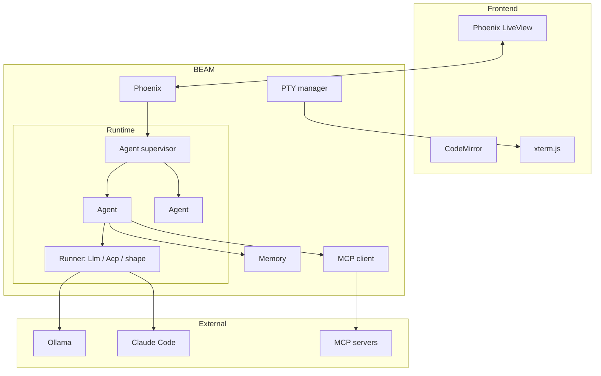

Because Jet **and** Phoenix both run on the BEAM, the whole Console ships as one OTP release (or a
single Burrito binary) with the Erlang runtime baked in.

---

## FAQ

**Use a local LLM?** Install Ollama, pull a model, and name it with `model "ollama:<model>"` — no
API key. Jet Console auto-detects your installed models in Settings.

**Use Claude Code?** `drives "claude-code-acp"` (via the ACP adapter) or `drives "claude"` (drive
the CLI directly). Private repos / auth follow the CLI's own login.

**Run agents in parallel?** Use a shape (`Fleet`, `Flow`, …), or the BEAM's concurrency directly —
each agent is a process. In the Console, each thread is independent and the board shows them at once.

**Verify an agent's output?** Use `Goal` with a machine-checkable `accept:` condition (e.g. a test
command); it loops until the check passes (up to `max_rounds`).

**Prevent dangerous operations?** An `approve do |req| … end` block gates each permission request
(`:allow` / `:deny`); in the Console, requests surface as 🔐 prompts.
